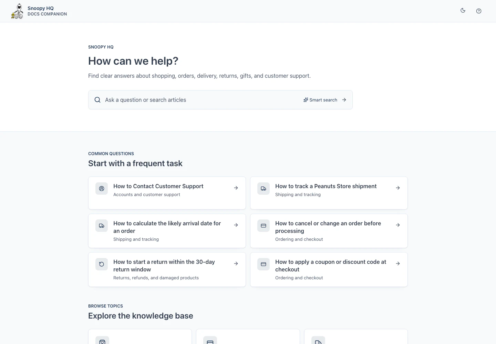
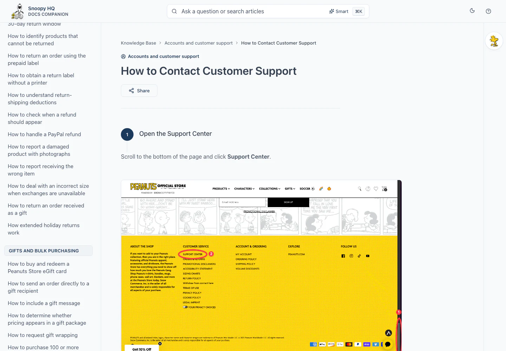
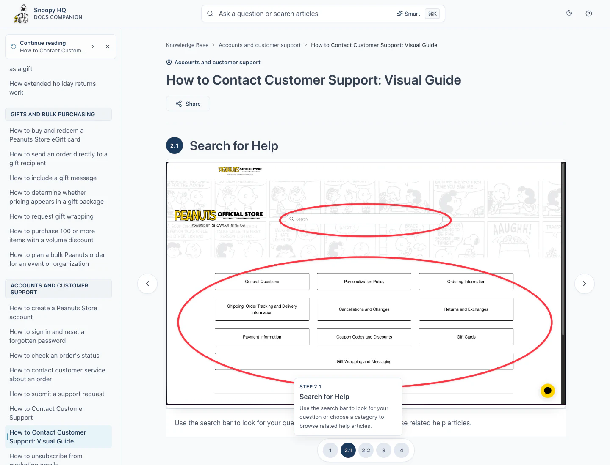
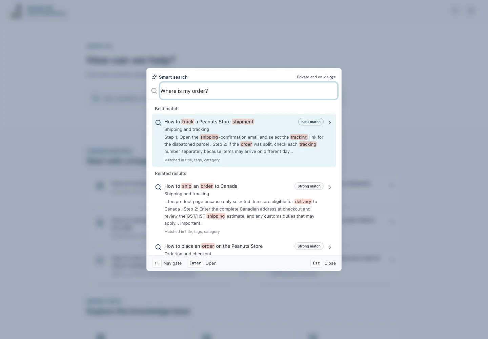

# Docs Companion Maintainer Manual

## Purpose

This is the short, practical guide for maintaining knowledge-base content. Use it when you need to:

- Add, edit, or remove an article.
- Add, replace, or remove an image.
- Link an image, document, video, or slideshow to an article.
- Check that navigation and Smart Search update correctly.

For architecture and implementation details, see [PROJECT_HANDOVER.md](./PROJECT_HANDOVER.md).

## Contents

| Task                              | Go to                                                                  |
| --------------------------------- | ---------------------------------------------------------------------- |
| Understand where content lives    | [1. Before editing](#1-before-editing)                                 |
| Publish a Markdown article fast   | [1b. Drop-in Markdown](#1b-the-fastest-path-a-drop-in-markdown-folder) |
| Choose standard or custom article | [2. Choose the article type](#2-choose-the-article-type)               |
| Add a text article                | [3. Add a standard article](#3-add-a-standard-article)                 |
| Add an article with images        | [4. Add a custom article](#4-add-a-custom-article)                     |
| Edit an article                   | [5. Edit an article](#5-edit-an-article)                               |
| Remove an article                 | [6. Remove an article](#6-remove-an-article)                           |
| Add or replace an image           | [7. Manage image assets](#7-manage-image-assets)                       |
| Remove an image                   | [8. Remove an image asset](#8-remove-an-image-asset)                   |
| Link assets in an article         | [9. Link assets to an article](#9-link-assets-to-an-article)           |
| Add a slideshow                   | [10. Add an interactive slideshow](#10-add-an-interactive-slideshow)   |
| Check the work                    | [11. Validate and preview](#11-validate-and-preview)                   |
| Fix common problems               | [12. Common problems](#12-common-problems)                             |

---

## 1. Before editing

### Start the project

From the project folder:

```bash
npm install
npm run dev
```

Open the local URL printed by Vite.

### Know the important files

| File or folder                   | What you edit there                                     |
| -------------------------------- | ------------------------------------------------------- |
| `src/content/catalog.ts`         | Category metadata and ordered article IDs only.         |
| `src/content/articles/standard/` | One file for every ordinary step-based article.         |
| `src/content/articles/custom/`   | One file for every article with custom content/layout.  |
| `src/content/articles/index.ts`  | Automatic discovery and the resolved article registry.  |
| `src/content/images.ts`          | Image IDs, imports, alt text, captions, and dimensions. |
| `src/content/documents.ts`       | Downloadable documents.                                 |
| `src/content/videos.ts`          | YouTube videos.                                         |
| `src/content/slideshows.ts`      | Interactive slideshow definitions.                      |
| `src/assets/media/articles/`     | Original article image files.                           |

### Do not manually edit generated files

```text
src/assets/media/optimized/
public/content-index.json
public/search-index.json
src/routeTree.gen.ts
.output/
```

The build recreates these files from the real content sources.

### Use stable IDs

Use lowercase kebab-case:

```text
shipping-track-order
accounts-reset-password
returns-damaged-product
```

Do not casually rename a published ID. The ID is used by links, navigation, search, saved reading state, and tests.

---

## 1b. The fastest path: a drop-in Markdown folder

Most articles no longer need a TypeScript file. Create a folder under
`src/content/import/`, put one `.md` file and its images inside, and run:

```bash
npm run optimize:images && npm run validate:content
```

The article publishes itself — sidebar entry, image registration, ids, and
circular step numbers all derived automatically. Nothing in `catalog.ts`,
`images.ts`, or `articles/` needs editing.

Full syntax and frontmatter reference:
[src/content/import/README.md](./src/content/import/README.md).

Use a TypeScript article instead when you need a custom layout or components
that Markdown cannot express.

## 2. Choose the article type

Use this quick rule:

| Article requirement                                   | Use                              |
| ----------------------------------------------------- | -------------------------------- |
| Text, simple steps, note, tags, and sources           | File under `articles/standard/`. |
| Images, documents, videos, nested steps, or slideshow | File under `articles/custom/`.   |

Every article is a module. The catalogue only references its ID for category placement and order.
If the article needs `[image:...]` or another asset token, use a custom article.

---

## 3. Add a standard article

Standard articles are concise modules created with `defineStandardArticle`. Navigation and Smart
Search update from the resolved article registry.

### Step 1: create the article file

Create:

```text
src/content/articles/standard/shipping-tracking/shipping-find-tracking-number.ts
```

Add:

```ts
import { defineStandardArticle } from "../../define-article";

export default defineStandardArticle({
  id: "shipping-find-tracking-number",
  categoryId: "shipping-tracking",
  title: "How to find an order tracking number",
  steps: [
    "Open the shipping confirmation email for the order.",
    "Find the carrier tracking link or tracking number in the message.",
    "Open the link to review the carrier's latest update.",
  ],
  note: "An order can have more than one tracking number when items ship separately.",
  sources: [
    {
      label: "Peanuts Store shipping policy",
      url: "https://peanuts.store/pages/shipping-policy",
    },
  ],
  tags: ["tracking", "shipment", "parcel", "delivery"],
});
```

### Step 2: reference its ID in the catalogue

Find the `shipping-tracking` group in `src/content/catalog.ts` and insert only the ID at the
required navigation position:

```ts
articleIds: [
  "shipping-track-order",
  "shipping-find-tracking-number",
  "shipping-tracking-not-updated",
],
```

Do not paste the article title or body into `catalog.ts`. The position in `articleIds` controls its
position in the sidebar.

### Step 3: check it

```bash
npm run validate:content
```

Then open:

```text
http://127.0.0.1:8081/?page=shipping-find-tracking-number
```

The article should also appear in the left navigation and Smart Search.



---

## 4. Add a custom article

Use a custom article when screenshots or special components are needed.

### Step 1: create the article file

Create:

```text
src/content/articles/custom/shipping-track-order-visual-guide.ts
```

Add:

```ts
import { imageIds } from "../../images";
import type { PageContent } from "../../types";

const article: PageContent = {
  id: "shipping-track-order-visual-guide",
  categoryId: "shipping-tracking",
  title: "How to track an order: Visual guide",
  lastUpdated: "2026-07-21",
  readTime: "3 min read",
  tags: ["tracking", "shipping", "visual-guide"],
  content: `## Step 1: Open the shipping email

Open the shipping confirmation sent for the order.

[image:${imageIds.trackingEmail}]

## Step 2: Open the tracking link

Select the carrier link and review the latest delivery update.

[image:${imageIds.carrierTrackingPage}]
`,
};

export default article;
```

The file is discovered automatically. Do not manually import it into `articles/index.ts`.

### Step 2: reference its ID in the catalogue

Add only the ID to the correct category's `articleIds` array:

```ts
articleIds: [
  "shipping-track-order",
  "shipping-track-order-visual-guide",
],
```

### Important

These values must agree:

```text
catalog article ID = article module ID = URL page value
catalog group ID = article categoryId
```

This is the expected reader layout after the custom article is connected:



---

## 5. Edit an article

### Edit a standard article

Find its module, then edit its title, steps, note, sources, or tags:

```bash
rg -l 'id: "shipping-find-tracking-number"' src/content/articles/standard
```

Keep the ID unchanged unless you are intentionally migrating links and saved state.

### Edit a custom article

Find its file:

```bash
rg 'guides-contact-customer-support' src/content/articles/custom
```

Edit the `PageContent` fields or the content string.

### Edit article order

Move its ID up or down inside the category's `articleIds` array in `catalog.ts`. Article files do
not contain navigation order.

### Edit tags

Use a small set of search terms that readers may actually type:

```ts
tags: ["tracking", "shipment", "parcel", "delivery"];
```

Title and tag matches have more search weight than ordinary body text.

---

## 6. Remove an article

For either article type, delete both:

1. Its string ID from the appropriate `articleIds` array in `catalog.ts`.
2. Its module under `src/content/articles/standard/` or `src/content/articles/custom/`.

Removing only the file creates a missing catalogue target. Removing only the ID creates an orphan
article. Content validation rejects both conditions.

### Check for references before deleting

```bash
rg 'article-id-being-removed' src
```

Review:

- Internal links such as `/?page=article-id-being-removed`.
- `parentArticleId` relationships.
- Chooser destinations.
- Tests that expect the article.

### Validate the deletion

```bash
npm run validate:content
npm run index:content
```

The rebuilt search index automatically removes deleted articles.

---

## 7. Manage image assets

### Add an image

#### Step 1: add the original

Place the PNG or JPEG in a topic folder:

```text
src/assets/media/articles/order-tracking/tracking-email.png
```

Use a meaningful lowercase filename.

#### Step 2: optimise images

```bash
npm run optimize:images
```

The script clears old generated images and recreates WebP files under:

```text
src/assets/media/optimized/order-tracking/
```

Do not edit the generated WebP files.

#### Step 3: register the image

In `src/content/images.ts`, import the generated files:

```ts
import trackingEmail from "@/assets/media/optimized/order-tracking/tracking-email.webp";
import trackingEmailReading from "@/assets/media/optimized/order-tracking/tracking-email-768.webp";
```

Add a stable ID:

```ts
export const imageIds = {
  // Existing IDs...
  trackingEmail: "tracking-email",
} as const;
```

Add the registry record:

```ts
[imageIds.trackingEmail]: {
  src: trackingEmail,
  srcSet: responsiveWebp(trackingEmailReading, trackingEmail, 1440),
  presentation: "wide",
  alt: "Shipping confirmation email with the carrier tracking link visible",
  caption: "Open the carrier link in the shipping confirmation email.",
  width: 1440,
  height: 900,
},
```

Replace `1440` and `900` with the real image dimensions.

### Replace an image

When the new image has the same purpose:

1. Replace the original source file.
2. Run `npm run optimize:images`.
3. Update dimensions in `images.ts` if they changed.
4. Keep the same image ID.

Articles do not need editing when the registry ID remains unchanged.

### Image writing rules

- `alt` explains what the image shows.
- `caption` explains what the reader should notice or do.
- Use `presentation: "wide"` for screenshots containing small interface text.
- Always provide real width and height to prevent layout movement.

---

## 8. Remove an image asset

### Step 1: find every use

Search using both the property and string ID:

```bash
rg 'imageIds\.trackingEmail|tracking-email' src
```

### Step 2: remove article references

Delete or replace every token that uses the image.

### Step 3: remove registry code

From `src/content/images.ts`, remove:

- The import statements.
- The `imageIds` property.
- The image registry record.

### Step 4: remove the original file

Remove it from `src/assets/media/articles/<topic>/`.

### Step 5: regenerate optimised assets

```bash
npm run optimize:images
npm run validate:content
```

The optimiser removes stale generated copies automatically.

---

## 9. Link assets to an article

Asset tokens must be on their own line.

### Image

```ts
import { imageIds } from "../../images";

content: `
## Step 1: Open the email

[image:${imageIds.trackingEmail}]
`;
```

### Image after an Action or Expected outcome

```md
**Action:** Open the carrier link. [image:tracking-email]

**Expected outcome:** The tracking page opens. [image:carrier-tracking-page]
```

Use different image IDs when the two screenshots are different.

### Document

Register it in `src/content/documents.ts`:

```ts
export const documents = {
  "returns-checklist": {
    name: "Returns checklist",
    href: "/docs/returns-checklist.pdf",
    description: "Information to prepare before starting a return.",
    kind: "pdf",
    size: "240 KB",
  },
} as const;
```

Link it in the custom article:

```md
[doc:returns-checklist]
```

### Video

Register it in `src/content/videos.ts`:

```ts
export const videos = {
  "track-order": "https://www.youtube.com/watch?v=VIDEO_ID",
} as const;
```

Link it:

```md
[video:track-order]
```

### Another article

```md
Read [How to track an order](/?page=shipping-track-order).
```

### Reusable callout

```md
[note:callout-id]
[warning:callout-id]
```

Unknown IDs fail content validation.

---

## 10. Add an interactive slideshow

### Step 1: register all slide images

Follow [7. Manage image assets](#7-manage-image-assets).

### Step 2: add the slideshow

In `src/content/slideshows.ts`:

```ts
export const slideshows = {
  "track-order-guide": {
    title: "How to track an order",
    storageKey: "track-order-guide",
    variant: "immersive",
    steps: [
      {
        stepNumber: "1",
        label: "Shipping email",
        title: "Open the shipping email",
        description: "Open the shipping confirmation sent for the order.",
        image: trackingEmail,
        alt: "Shipping confirmation email with tracking information",
      },
      {
        stepNumber: "2",
        label: "Carrier page",
        title: "Review the carrier status",
        description: "Open the tracking link and review the latest scan.",
        image: carrierTrackingPage,
        alt: "Carrier tracking page showing the latest shipment scan",
      },
    ],
  },
};
```

### Step 3: link it in a custom article

For a slideshow inside a normal article:

```md
[slideshow:track-order-guide]
```

For the full interactive layout:

```ts
const article: PageContent = {
  // Other fields...
  layout: "immersive-slideshow",
  content: "[slideshow:track-order-guide]",
};
```

Keep `storageKey` stable so returning readers keep their last slide.



---

## 11. Validate and preview

### Minimum check after content changes

```bash
npm run validate:content
npx tsc --noEmit
```

### Full release check

```bash
npx tsc --noEmit
npm run lint
npm run validate:content
npx vitest run src
npm run build
```

The production build automatically:

1. Rebuilds optimised images.
2. Validates content.
3. Regenerates content and search indexes.
4. Builds the application.

### Browser checklist

- Article appears in the correct category.
- Article opens from its deep link.
- Steps are in the correct order.
- Images are large and readable.
- Image alt text is meaningful.
- Internal links open the correct article.
- Smart Search finds the article using its title and tags.
- Mobile and desktop layouts remain usable.



---

## 12. Common problems

### Unknown image reference

```text
Unknown image reference: tracking-email
```

Check that:

1. `imageIds` contains the ID.
2. `images` contains a record using that ID.
3. The article imports and references the correct property.

### Article does not appear

Check that:

1. The file is inside `src/content/articles/standard/` or `src/content/articles/custom/`.
2. It has a default export.
3. Its ID appears in exactly one catalogue `articleIds` array.
4. The catalogue ID and article module ID match exactly.
5. `categoryId` matches the catalogue group ID.

Run `npm run validate:content`; missing targets and unlisted modules are reported as errors.

### Broken internal link

```text
/?page=missing-article
```

Search for the old ID:

```bash
rg 'missing-article' src
```

Correct or remove every reference.

### Image looks blurry

- Use the original full-resolution source.
- Run `npm run optimize:images` again.
- Register both full and 768px variants when generated.
- Check that `srcSet`, width, and height are correct.
- Use `presentation: "wide"` for detailed screenshots.

### Search does not find the article

- Confirm the article is in `pageContents` by running validation.
- Add a clear title and useful tags.
- Run `npm run index:content`.
- Restart the development server if HMR did not detect the change.

---

## Quick checklist

### Adding

- [ ] Use a unique stable ID.
- [ ] Choose standard or custom article.
- [ ] Create one dedicated article module.
- [ ] Add only its ID to the catalogue.
- [ ] Put it in the correct category and order.
- [ ] Add factual sources and useful tags.
- [ ] Register assets before linking them.
- [ ] Add alt text, dimensions, and captions.
- [ ] Validate and preview.

### Removing

- [ ] Search the repository for references.
- [ ] Remove article or asset links first.
- [ ] Remove the catalogue ID and article module together.
- [ ] Remove registry records and imports.
- [ ] Remove original media only after references are gone.
- [ ] Rebuild optimised assets and indexes.
- [ ] Validate and preview.

## Golden rule

Edit article content in its module, navigation order in the reference-only catalogue, and reusable
assets in their registries. Never maintain generated search indexes or optimised assets by hand.
