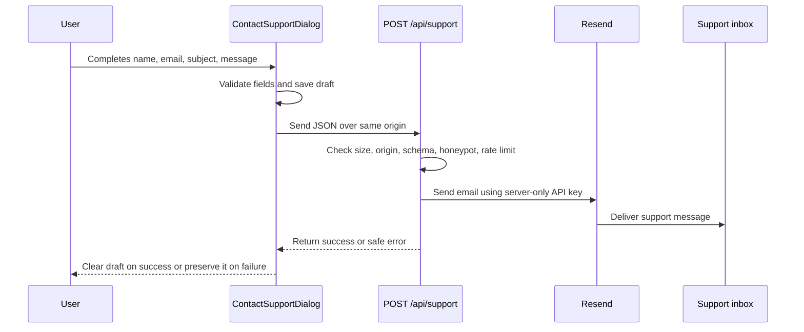
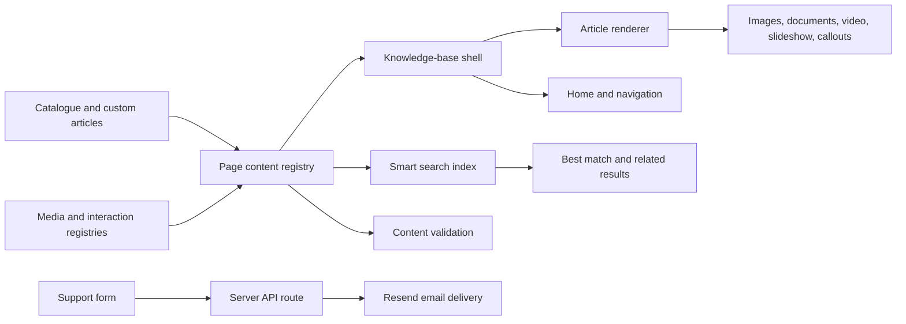

# Docs Companion: Project Portfolio and Technical Handover

## Document purpose

This document serves two audiences:

1. **Portfolio readers** can use the first sections to understand the problem, design decisions, implementation scope, and technical capabilities demonstrated by the project.
2. **Future maintainers** can use the remaining sections as a practical handover guide for running, editing, testing, and extending the application.

The repository is a modern, content-driven knowledge-base application currently presented as the **Snoopy HQ Support Centre**. It combines searchable help articles, responsive navigation, visual walkthroughs, interactive slides, direct customer-support messaging, theme support, content validation, and automated media optimisation.

For the detailed visual language, also read [Design.md](./Design.md). For search-specific implementation notes, read [docs/smart-search.md](./docs/smart-search.md).

## Table of contents

| Section                                                  | Subject                                                                                               |
| -------------------------------------------------------- | ----------------------------------------------------------------------------------------------------- |
| [0](#0-start-here-if-you-know-nothing-about-the-project) | Zero-context introduction, vocabulary, runtime flows, state ownership, and recommended reading order. |
| [1](#1-portfolio-overview)                               | Portfolio case study, project problem, solution, capabilities, outcomes, and interface screenshots.   |
| [2](#2-technical-summary)                                | Technology stack, architectural principles, and runtime flow.                                         |
| [3](#3-project-structure)                                | Repository tree and directory ownership.                                                              |
| [4](#4-application-implementation)                       | Root application, routes, shell, home page, navigation, and Table of Contents.                        |
| [5](#5-components-classes-and-styling-conventions)       | Branding assets, shared UI editing, React components, Tailwind classes, CVA variants, and primitives. |
| [6](#6-content-architecture)                             | Article types, stable IDs, and standard versus custom authoring.                                      |
| [7](#7-article-formatting-and-content-tokens)            | Supported headings, links, callouts, details, steps, and registry tokens.                             |
| [8](#8-adding-and-managing-images)                       | Source images, optimisation, registration, replacement, and article linking.                          |
| [9](#9-interactive-slideshow-component)                  | Slideshow model, creation, embedding, immersive layout, and authoring rules.                          |
| [10](#10-smart-search-implementation)                    | Ranking, confidence, automatic indexing, performance, and limitations.                                |
| [11](#11-support-request-and-email-delivery)             | Contact form, API security, Resend delivery, and environment variables.                               |
| [12](#12-saved-state-and-navigation-continuity)          | URL, local-storage, and session-storage behaviour.                                                    |
| [13](#13-mcp-integration)                                | Read-only MCP tools and shared content access.                                                        |
| [14](#14-running-and-building-the-project)               | Installation, local development, validation, building, and previewing.                                |
| [15](#15-content-validation)                             | Content graph and integrity checks.                                                                   |
| [16](#16-testing-strategy)                               | Unit, property-based, visual, and manual testing.                                                     |
| [17](#17-future-maintenance-guide)                       | Safe change workflow, ownership, dependencies, security, accessibility, and performance.              |
| [18](#18-known-limitations-and-recommended-improvements) | Current constraints and recommended roadmap.                                                          |
| [19](#19-release-checklist)                              | Content, media, interaction, and quality gates.                                                       |
| [20](#20-quick-reference)                                | Short operational recipes.                                                                            |
| [Appendix A](#appendix-a-function-and-module-reference)  | Detailed project-specific function, component, hook, route, and script reference.                     |
| [Appendix B](#appendix-b-worked-change-examples)         | Complete worked examples and troubleshooting scenarios.                                               |

---

## 0. Start here if you know nothing about the project

### What this application is

This is a website for reading and searching help documentation. The user can start on a home page, search for a question, browse a category, open an article, follow written or visual steps, and contact support if the documentation does not solve the problem.

The application is not a traditional collection of separately authored HTML pages. Most pages are assembled from structured TypeScript content. The same content is used to build:

- The home-page recommendations.
- The left navigation sidebar.
- Article breadcrumbs.
- The right Table of Contents.
- Related-article suggestions.
- Smart Search records.
- Generated public content files.
- MCP responses for connected tools.

This is the central idea behind the project: **write the content once, register reusable assets once, and derive every reader-facing view from those sources**.

### Essential vocabulary

| Term             | Meaning in this project                                                                                                                                       |
| ---------------- | ------------------------------------------------------------------------------------------------------------------------------------------------------------- |
| Article          | One help page represented by a `PageContent` object.                                                                                                          |
| Article ID       | A stable kebab-case identifier such as `accounts-submit-support-request`. It forms part of the deep link and connects navigation, search, storage, and tests. |
| Category         | A top-level subject group such as Shopping, Shipping, or Accounts and customer support.                                                                       |
| Catalogue        | `src/content/catalog.ts`, which contains category metadata and ordered article-ID references only.                                                            |
| Standard article | A dedicated module under `articles/standard/`, converted from concise steps and sources into `PageContent`.                                                   |
| Custom article   | A dedicated module under `articles/custom/` for hand-authored content, images, nested steps, interactions, or special layouts.                                |
| Registry         | A central object that maps a stable string ID to an image, document, video, slideshow, callout, quiz, or chooser.                                             |
| Token            | A short marker inside article content, such as `[image:request-form]`, that the renderer replaces with a React component.                                     |
| Renderer         | The code that converts an article's controlled Markdown-like content into headings, paragraphs, media, callouts, and interactions.                            |
| Corpus           | The complete body of searchable articles and registered metadata.                                                                                             |
| Search index     | The flattened, normalised records used by local fuzzy and weighted search.                                                                                    |
| Deep link        | A URL that opens a specific article, for example `/?page=accounts-submit-support-request`.                                                                    |
| Hydration        | React attaching browser behaviour to the HTML produced during server rendering.                                                                               |
| HMR              | Vite Hot Module Replacement, which updates changed modules during development without a full reload.                                                          |
| MCP              | A read-only protocol surface through which connected tools can list, search, and retrieve knowledge-base articles.                                            |

### The shortest useful mental model

Think of the system as five connected layers:

```text
1. Content sources
   articles/standard/**/*.ts + articles/custom/*.ts + media registries

2. Content assembly
   article module auto-discovery + reference-only catalog.ts ordering

3. Derived data
   sidebar categories + search records + related articles + public indexes

4. Reader interface
   KnowledgeBase + article renderer + home + dialogs + slideshows

5. Server capabilities
   support email API + SSR error handling + MCP endpoints
```

If a maintainer understands where a change belongs in those five layers, most work in this repository becomes predictable.

### What happens when a visitor first opens the site

The following sequence explains the runtime from the first HTTP request to an interactive screen.

1. The hosting runtime calls the default `fetch()` handler exported by `src/server.ts`.
2. `getServerEntry()` lazily imports TanStack Start's generated server entry. The import is cached so later requests do not repeat the module setup.
3. TanStack Router matches the `/` route from `src/routes/index.tsx`.
4. `searchSchema` validates the URL values `q`, `page`, and `cats`. Missing or malformed values fall back to safe empty values.
5. The root route from `src/routes/__root.tsx` creates the HTML shell, metadata, stylesheet links, favicon, theme bootstrap script, and script tags.
6. `RootComponent()` places React Query, the active route outlet, and the global toast system around the page.
7. The index route renders `KnowledgeBase` from `src/components/knowledge-base.tsx`.
8. `KnowledgeBase` reads the validated URL state. If `page` is empty, it shows `KnowledgeBaseHome`; otherwise it resolves the article from `pageContents`.
9. The server returns HTML. The browser downloads the JavaScript and React hydrates the page.
10. Browser-only features then activate, including local storage restoration, search indexing, scroll tracking, hover behaviour, keyboard controls, and slideshow progress.

The route and shell relationship can be pictured as:

```tsx
// Simplified composition, not a separate source file.
<RootShell>
  <QueryClientProvider>
    <Outlet>
      <KnowledgeBase />
    </Outlet>
    <Toaster />
  </QueryClientProvider>
</RootShell>
```

### What happens when a visitor opens an article

Suppose the browser opens:

```text
/?page=guides-contact-customer-support
```

The application performs the following work:

1. The route parser reads `page` as `guides-contact-customer-support`.
2. `getPage()` looks up that exact ID in `pageContents`.
3. `findCategoryForPage()` identifies the category that contains the article.
4. `getNumbering()` calculates the article's navigation number, including dotted numbering for child articles.
5. `extractHeadings()` scans the article content and creates the Table of Contents data.
6. `getRelatedArticles()` compares tags and category membership to select related reading.
7. `FormattedArticleContent` calls `formatContent()` to transform every supported content line into React output.
8. Media tokens call registry lookup functions such as `getImage()` or `getSlideshow()`.
9. The Table of Contents watches scrolling and saves the last active section.
10. The main shell saves the article as the user's most recently opened page.

No network request is needed to fetch the article because the catalogue is compiled into the application bundle.

### What happens when article content is rendered

An article's `content` is a plain string:

```ts
content: `
## Step 1: Open the Support Center

Scroll to the footer and select **Support Center**.

[image:${imageIds.supportFooterLink}]
`.trim();
```

The controlled renderer handles it in phases:

1. `consolidateCallouts()` joins multi-line callout text into a safe internal representation.
2. `[details]` and `[stickysteps]` blocks are extracted before ordinary line parsing because they contain nested content.
3. The remaining content is split into lines.
4. Each line is tested in a deliberate order: interactive block, callout, media token, heading, step cue, list item, blank line, then paragraph.
5. Inline text is passed to `renderInlineMarkdown()` for bold text and links.
6. Search terms are passed to the inline renderer so matching words can be highlighted without injecting HTML.
7. Unknown registry IDs render a visible error during development and are also caught by content validation.

The order matters. For example, `[image:id]` must be recognised before the fallback paragraph branch, or it would appear as literal text.

### What happens during a Smart Search query

For a query such as:

```text
my parcel says delivered but I cannot find it
```

the search flow is:

1. `useKbSearch()` receives the current input string.
2. `tokenize()` lowercases the text, removes a small stopword set, preserves useful hyphenated terms, and stems the remaining words.
3. `expandSearchQuery()` adds conservative synonyms and detects known support intents. In this example, it adds concepts related to shipment, delivery, tracking, and missing packages.
4. `createFuse()` provides typo-tolerant candidates over weighted stemmed fields.
5. `searchKnowledgeBase()` independently calculates exact, semantic, fuzzy, and typo evidence.
6. Title and tag evidence is weighted above ordinary body text.
7. A confidence score determines whether the interface can honestly label one result as Best match.
8. `buildRelevantSnippet()` selects the indexed field with the strongest evidence.
9. `buildSnippet()` extracts a readable window around the densest cluster of matching stems.
10. `SmartSearchDialog` renders the best match, related results, confidence badges, highlights, and keyboard selection.

A query never leaves the browser and no generative model invents an answer.

### What happens when support is contacted

The browser and server divide responsibility deliberately:



The visitor's address is used as `reply_to`, not as the sender. This lets the support team press Reply while still satisfying Resend sender-verification requirements.

### What happens during a production build

Running `npm run build` first triggers the `prebuild` script:

```json
{
  "prebuild": "npm run optimize:images && npm run validate:content && npm run index:content",
  "build": "vite build"
}
```

The sequence is:

1. Delete old generated image derivatives.
2. Rebuild WebP and responsive image variants from current source assets.
3. Validate all content, links, category relationships, hierarchy, and registry tokens.
4. Rebuild `public/content-index.json` and `public/search-index.json` from current sources.
5. Ask Vite and TanStack Start to bundle the browser and server application.
6. Write deployable output to `.output/`.

If an article is deleted from the sources, it disappears from the rebuilt catalogue and search index. If an image is replaced, stale optimised versions are removed before new derivatives are created.

### Where state lives and why

| State                       | Storage location                       | Reason                                                                             |
| --------------------------- | -------------------------------------- | ---------------------------------------------------------------------------------- |
| Open article                | URL `page` parameter                   | Must be shareable and work with browser history.                                   |
| Search text                 | URL `q` plus local input state         | URL is shareable; local state keeps typing responsive before debounced navigation. |
| Category filters            | URL `cats` parameter                   | Filtered views can be restored and shared.                                         |
| Light or dark theme         | `localStorage` and `<html>` attributes | Persists between visits and is applied before hydration.                           |
| Last article                | `localStorage`                         | Powers Continue reading without changing the current URL.                          |
| Last active section         | `localStorage` per article             | Restores reading context.                                                          |
| Left navigation scroll      | `localStorage`                         | Keeps the selected article visible after navigation or reload.                     |
| Details open state          | `localStorage` per article and summary | Restores intentionally opened explanations.                                        |
| Slideshow step              | `localStorage` using `storageKey`      | Returns the user to the last viewed step.                                          |
| Support draft               | `localStorage`                         | Prevents message loss after accidental closing or delivery failure.                |
| Temporary warmed media      | `sessionStorage` and memory            | Avoids repeated preloading during one browser session.                             |
| Component interaction state | React `useState`                       | Appropriate for transient dialog, hover, selected slide, and loading state.        |

### Recommended reading order for a new developer

Read these files in this order:

1. `src/content/types.ts` to learn the article and sidebar contracts.
2. `src/content/catalog.ts` to see category grouping and ordered article references.
3. `src/content/articles/index.ts` to see how all article modules become one validated map.
4. One file in `src/content/articles/standard/`, then one in `custom/`, to compare authoring modes.
5. `src/content/images.ts` and `src/content/slideshows.ts` to understand registries.
6. `src/routes/index.tsx` and `src/routes/__root.tsx` to understand routing and the application shell.
7. The exported `KnowledgeBase` component near the bottom of `src/components/knowledge-base.tsx`.
8. `formatContent()` in the same file to understand article rendering.
9. `src/lib/kb-search.ts`, then `src/lib/smart-search.ts`, then `src/hooks/use-kb-search.ts`.
10. `src/routes/api/support.ts` for the server-side workflow.
11. `scripts/validate-content.ts` and `scripts/build-content-index.ts` before changing the content model.

Do not begin with `src/routeTree.gen.ts`. It is generated router output and is not an authoring surface.

---

## 1. Portfolio overview

### Project summary

Docs Companion is a self-service support centre designed to make product and customer-service information easy to find, understand, and act on. The application replaces a basic document list with a structured knowledge base that supports:

- Natural-language and typo-tolerant search.
- Standard articles and richer custom article layouts.
- Large, legible instructional screenshots.
- Interactive step-by-step slideshows.
- Responsive desktop, tablet, and mobile navigation.
- Light and dark colour modes.
- Continue-reading and last-position recovery.
- A direct support form that does not require the visitor to open an email application.
- Automatic article indexing and media optimisation during production builds.
- A read-only MCP interface for future tool and assistant integrations.

### The problem

Traditional support pages often fail in several predictable ways:

- Users must already know the exact terms used by the documentation.
- Screenshots are too small to read without opening a lightbox.
- Long navigation trees become difficult to scan.
- Users lose their place after leaving an article.
- Content, search records, and media references must be maintained separately.
- Contact links open a mail application rather than submitting a structured request.
- Mobile layouts feel like compressed desktop pages instead of purposeful interfaces.

### The solution

The project treats the article catalogue as a single source of truth. Navigation, search, deep links, content validation, and generated search files all derive from the same content model. Rich articles can opt into custom media and layouts without forcing every article to become a hand-built component.

The resulting experience has four main layers:

1. **Discover:** a focused home page, category navigation, suggestions, and smart search.
2. **Read:** responsive article typography, visible steps, table of contents, and large media.
3. **Resume:** saved article, sidebar position, section position, open details, and slideshow progress.
4. **Escalate:** a validated support form that sends the request directly to the configured support inbox.

### Capabilities demonstrated

This project can be presented as evidence of work across:

- Product and interaction design.
- Information architecture.
- Responsive front-end engineering.
- Type-safe content modelling.
- Search and relevance ranking.
- Accessibility and keyboard interaction.
- Media performance optimisation.
- Server-side form validation and email delivery.
- Automated content integrity checks.
- Unit, property-based, and visual regression testing.
- Maintainable handover and operational documentation.

### Representative outcomes

At the latest verified implementation state, the generated catalogue contained:

- 6 knowledge-base categories.
- 64 articles.
- 17 registered article images.
- 5 registered videos.
- 2 registered documents.
- 2 registered slideshows.
- 4 reusable callouts.

The image pipeline reduced the then-current article image set from approximately 5.83 MB to 2.29 MB, a reduction of about 61 percent. These figures are build-time snapshots and should be regenerated rather than manually updated when the catalogue changes.

### Interface walkthrough

The following screenshots were captured from the running application on 21 July 2026 using Playwright at a desktop viewport. They are documentation assets stored in `docs/screenshots/`, not article media and not part of the application's runtime bundle.

#### Focused knowledge-base home


The home screen intentionally omits the article navigation sidebar. It gives a first-time visitor one prominent Smart Search entry point, a short set of frequent tasks, and category browsing without exposing the complete article hierarchy too early.

#### Smart Search results


This state demonstrates natural-language input, a clearly labelled Best match, related-result confidence badges, matching excerpts, highlighted evidence, on-device privacy messaging, and keyboard guidance.

#### Standard article reader


The article layout keeps the complete information hierarchy visible: global header, searchable navigation, breadcrumbs, category context, dominant article title, Share action, step content, readable instructional media, and the floating Table of Contents launcher.

#### Interactive slideshow


The slideshow capture shows nested step `2.1`, the larger image treatment, bounded previous and next navigation, the expanded step pill, and the step preview card. The same controls support pointer, keyboard, focus, saved progress, and reduced-motion behaviour.

### Responsible portfolio presentation

The application uses Peanuts-related names and visual assets as its demonstration content. Before a public commercial deployment, confirm that the organisation has permission to use all logos, character artwork, screenshots, trademarks, and copied support material. For a public personal portfolio, clearly describe the project as an independent demonstration unless it is officially commissioned or licensed.

---

## 2. Technical summary

### Main technology stack

| Technology                           | Purpose                             | Why it is used                                                                                           |
| ------------------------------------ | ----------------------------------- | -------------------------------------------------------------------------------------------------------- |
| React 19                             | Component rendering and interaction | Supports composable functional components, hooks, concurrent rendering features, and a mature ecosystem. |
| TypeScript                           | Application and content typing      | Prevents invalid content shapes and makes registries, routes, and component APIs safer to maintain.      |
| TanStack Start and TanStack Router   | Full-stack routing                  | Provides typed search parameters, server routes, deep links, and browser-history integration.            |
| Vite 8                               | Development and production bundling | Provides fast local development, hot module replacement, and an extensible build pipeline.               |
| Tailwind CSS 4                       | Component styling                   | Keeps responsive and state-driven styling close to components while using shared semantic tokens.        |
| Radix UI and shadcn-style primitives | Accessible UI foundations           | Supplies reliable behaviour for dialogs, menus, tooltips, accordions, and other controls.                |
| Framer Motion                        | Slideshow and navigation motion     | Provides directional transitions, presence handling, and reduced-motion support.                         |
| Fuse.js                              | Fuzzy matching                      | Supplies lightweight typo tolerance without a hosted service or large browser model.                     |
| cmdk                                 | Search command interface            | Provides familiar keyboard-driven result navigation and command-palette interaction.                     |
| Zod                                  | Runtime validation                  | Validates route parameters, support requests, and other untrusted data at runtime.                       |
| Lucide React                         | Interface icons                     | Keeps icons visually consistent, accessible, and easy to replace.                                        |
| Sonner                               | Toast notifications                 | Provides compact themed feedback such as the article-link copied confirmation.                           |
| Sharp                                | Build-time image optimisation       | Produces efficient WebP derivatives and responsive image variants.                                       |
| Vitest and fast-check                | Unit and property testing           | Tests deterministic search behaviour and broad input combinations.                                       |
| Playwright                           | Visual and browser testing          | Verifies responsive layout, themes, interaction, and regression baselines.                               |
| Nitro and Lovable Vite configuration | Production server output            | Builds the TanStack application for the configured cloud runtime, currently Cloudflare-oriented.         |
| Resend REST API                      | Support email delivery              | Sends support requests directly from the server without exposing credentials in the browser.             |

### Architectural principles

- **Content is data:** most articles are records, not one component per page.
- **Registries are authoritative:** image, video, document, slideshow, and interactive IDs are defined centrally.
- **Generated files are disposable:** search indexes and optimised assets are rebuilt from source content.
- **UI and ranking are separate:** search indexing and scoring remain independently testable.
- **URLs are durable:** article IDs are stable deep-link identifiers.
- **Progressive enhancement:** storage, animation, and media warming fail gracefully when unavailable.
- **Theme-safe styling:** semantic CSS variables are preferred over hard-coded colours.

### Runtime flow



---

## 3. Project structure

```text
Docs Companion/
|-- Design.md
|-- PROJECT_HANDOVER.md
|-- package.json
|-- vite.config.ts
|-- .env.example
|-- docs/
|   |-- screenshots/             # Portfolio and handover captures
|   |-- smart-search.md
|   `-- visual-baselines.md
|-- public/
|   |-- content-index.json       # Generated
|   `-- search-index.json        # Generated
|-- scripts/
|   |-- build-content-index.ts
|   |-- optimize-images.mjs
|   |-- validate-content.ts
|   |-- audit-colors.mjs
|   `-- update-visual-baselines.mjs
|-- src/
|   |-- routes/
|   |   |-- __root.tsx
|   |   |-- index.tsx
|   |   |-- api/support.ts
|   |   `-- mcp routes...
|   |-- components/
|   |   |-- knowledge-base.tsx
|   |   |-- knowledge-base-home.tsx
|   |   |-- smart-search-dialog.tsx
|   |   |-- immersive-slideshow.tsx
|   |   |-- contact-support-dialog.tsx
|   |   |-- kb-*.tsx
|   |   `-- ui/
|   |-- content/
|   |   |-- catalog.ts
|   |   |-- categories.tsx
|   |   |-- types.ts
|   |   |-- brand.ts
|   |   |-- images.ts
|   |   |-- videos.ts
|   |   |-- documents.ts
|   |   |-- slideshows.ts
|   |   |-- callouts.ts
|   |   |-- quizzes.ts
|   |   |-- choosers.ts
|   |   `-- articles/
|   |       |-- define-article.ts
|   |       |-- index.ts
|   |       |-- standard/
|   |       `-- custom/
|   |-- assets/media/
|   |   |-- articles/            # Source media
|   |   `-- optimized/           # Generated media
|   |-- hooks/
|   |-- lib/
|   |   |-- smart-search.ts
|   |   |-- kb-search.ts
|   |   |-- inline-md.tsx
|   |   |-- contact-support.ts
|   |   `-- mcp/
|   `-- styles.css
|-- tests/visual/
|-- .output/                     # Generated deployment output
`-- node_modules/                # Installed dependencies
```

### Directory responsibilities

| Location                            | Source of truth for                                                                      |
| ----------------------------------- | ---------------------------------------------------------------------------------------- |
| `src/content/catalog.ts`            | Category metadata and ordered article-ID references; never article bodies.               |
| `src/content/articles/standard/`    | One module per ordinary step-based article.                                              |
| `src/content/articles/custom/`      | One module per rich article requiring custom tokens, media, or layouts.                  |
| `src/content/articles/index.ts`     | Automatic module discovery, duplicate detection, catalogue ordering, and `pageContents`. |
| `src/content/images.ts`             | Stable image IDs, imports, alt text, captions, dimensions, and responsive sources.       |
| `src/content/slideshows.ts`         | Slideshow definitions and step order.                                                    |
| `src/content/*.ts` registries       | Reusable videos, documents, notes, quizzes, and choosers.                                |
| `src/components/knowledge-base.tsx` | Main shell, navigation behaviour, article parsing, and token rendering.                  |
| `src/lib/smart-search.ts`           | Pure query normalisation, expansion, ranking, and confidence logic.                      |
| `src/styles.css`                    | Global design tokens, colour modes, typography, and shared utility classes.              |
| `scripts/`                          | Build-time indexing, validation, image optimisation, and visual tooling.                 |
| `public/*.json`                     | Generated catalogue and search output. Do not edit these manually.                       |

---

## 4. Application implementation

### Root application

`src/routes/__root.tsx` provides the global application shell. It is responsible for:

- Rendering the current route through `Outlet`.
- Initialising shared providers such as the query client.
- Installing the global toast renderer.
- Applying theme setup before the visible interface paints.
- Defining global document metadata and font resources.

The application currently uses a Query Client provider even though most knowledge-base content is local. This leaves a standard place for future server-state features without coupling ordinary article rendering to network requests.

### Main route and URL state

`src/routes/index.tsx` validates the root route's search parameters with Zod:

```ts
{
  q: string;
  page: string;
  cats: string[];
}
```

The public deep-link format is:

```text
/?page=article-id
```

Search text and category filters also remain in the URL. This preserves browser Back and Forward behaviour, allows links to be shared, and prevents navigation state from being trapped inside one component.

### Main knowledge-base shell

`src/components/knowledge-base.tsx` coordinates the primary experience:

- Header and brand treatment.
- Desktop and mobile navigation.
- Left article/category navigation.
- Home-page rendering.
- Article rendering and breadcrumbs.
- Right-side table of contents.
- Share control and themed notifications.
- Contact Support entry point.
- Continue-reading state.
- Section tracking and highlight behaviour.
- Parsing special content tokens into registered components.

This component is intentionally the integration point. Reusable behaviours such as search, slideshows, dialogs, callouts, and primitive controls remain in separate files.

### Home page

`src/components/knowledge-base-home.tsx` presents a focused entry screen with:

- A prominent control labelled **Ask a question or search articles**.
- A subtle Smart Search indicator.
- Common articles and category entry points.
- A cleaner layout that omits the article sidebar until an article is opened.

The home page is the discovery surface, while the full navigation shell appears when users enter the documentation hierarchy.

### Table of contents

The right-side Table of Contents follows the reading position and can collapse into a circular, modular launcher. Its behaviour includes:

- Hover or focus expansion on suitable pointer devices.
- Closing after the user selects a section.
- Active-section highlighting.
- Immediate section tracking through scroll observation.
- A persistent launcher that remains available while reading.
- Theme-aware styling and reduced-motion behaviour.

The launcher image and website logo are configured as content assets rather than being embedded directly into component code. That keeps branding replaceable for future deployments.

---

## 5. Components, classes, and styling conventions

### Editing branding and shared UI elements

The brand artwork, product names, accessible labels, colours, and component display sizes are intentionally separated. Most rebranding work starts in `src/content/brand.ts`; component files should only be edited when the **layout, size, or motion** must change.

#### Branding ownership map

| UI element                                             | Primary file                                  | What it controls                                             |
| ------------------------------------------------------ | --------------------------------------------- | ------------------------------------------------------------ |
| Header logo artwork                                    | `src/assets/brand/snoopy-woodstock-logo.webp` | The image displayed beside the site name.                    |
| Right Table of Contents launcher artwork               | `src/assets/brand/right-sidebar-bird.svg`     | The image inside the circular floating launcher.             |
| Brand imports, names, intrinsic dimensions, and labels | `src/content/brand.ts`                        | Central configuration consumed by the application shell.     |
| Browser-tab icon                                       | `public/favicon.png`                          | Favicon requested directly by the browser.                   |
| Header logo display size                               | `src/components/knowledge-base.tsx`           | Responsive CSS classes applied to the header image.          |
| Launcher circle, icon size, and bounce                 | `src/components/knowledge-base.tsx`           | Button dimensions and Framer Motion animation.               |
| Visible “Table of Contents” title                      | `src/components/knowledge-base.tsx`           | Heading shown in the open outline card.                      |
| Light and dark theme colours                           | `src/styles.css`                              | Semantic colour, border, radius, shadow, and sidebar tokens. |

Brand files are separate from article media. They do not need an entry in `src/content/images.ts`, and `npm run optimize:images` does not process them.

#### Change the site name and header labels

Edit the text values in `src/content/brand.ts`:

```ts
export const siteBrand = {
  name: "Snoopy HQ",
  productName: "Docs Companion",
  homeLabel: "Go to Snoopy HQ home",
  navigation: {
    title: "Documentation",
    description: "Browse support topics",
  },
  // Assets and page-outline labels follow.
} as const;
```

- `name` is the prominent brand name in the header and home page.
- `productName` is the smaller header label.
- `homeLabel` is the accessible name for the logo/home button. Update it whenever the brand name changes.
- `navigation.title` and `navigation.description` label the article navigation.

#### Replace the header logo

The current source is:

```text
src/assets/brand/snoopy-woodstock-logo.webp
```

The simplest replacement is to overwrite that file with another transparent WebP using the same filename. If the filename or format changes, update the import at the top of `src/content/brand.ts`:

```ts
import siteLogoSrc from "@/assets/brand/new-company-logo.webp";
```

Then update the intrinsic metadata:

```ts
assets: {
  logo: {
    src: siteLogoSrc,
    width: 640,
    height: 640,
    alt: "New Company logo",
  },
}
```

`width` and `height` must be the source image's real pixel dimensions. They reserve the correct aspect ratio before the asset loads. The header currently renders the logo as:

```tsx
className = "h-11 w-9 shrink-0 object-contain";
```

Search for `siteBrand.assets.logo.src` in `src/components/knowledge-base.tsx` to find this element. Change `h-11 w-9` only when the displayed size or aspect ratio needs adjustment. Keep `object-contain` so the logo is not cropped, and test narrow mobile widths after making it larger.

The image is decorative inside a button, so the rendered `` is hidden from assistive technology. The button receives its accessible name from `siteBrand.homeLabel`; the configured asset `alt` remains useful metadata for any future placement where the logo is informative.

#### Replace the right-sidebar launcher icon

The current source is:

```text
src/assets/brand/right-sidebar-bird.svg
```

Replace that file with another transparent SVG using the same filename, or update this import in `src/content/brand.ts`:

```ts
import pageOutlineIconSrc from "@/assets/brand/new-outline-icon.svg";
```

Update the registry entry with the new source dimensions and description:

```ts
pageOutlineIcon: {
  src: pageOutlineIconSrc,
  width: 193,
  height: 193,
  alt: "Illustrated page-outline launcher",
},
```

For an SVG, the intrinsic dimensions should agree with its `viewBox`. Use a square canvas and transparent background where possible; this prevents an off-centre illustration from appearing cramped inside the circle.

The launcher uses these display sizes in `src/components/knowledge-base.tsx`:

```tsx
// Circular button: 52 x 52 px.
className = "h-[3.25rem] w-[3.25rem] rounded-full p-1.5";

// Artwork inside the circle: 36 x 36 px.
className = "h-9 w-9 object-contain";
```

Search for `siteBrand.assets.pageOutlineIcon.src` to reach the exact block. Keep the circular button at least 44 by 44 pixels for touch accessibility. If the artwork looks too small, first adjust the icon's internal SVG `viewBox` or whitespace; increasing the whole launcher should be the second choice.

#### Edit the launcher bounce and card animation

The same `MotionButton` block controls the subtle idle movement:

```tsx
animate={{
  y: [0, -6, 0, -2, 0],
  rotate: [0, -1.5, 1.5, -0.5, 0],
}}
transition={{
  duration: 1.35,
  repeat: Infinity,
  repeatDelay: 2.6,
  ease: "easeInOut",
}}
```

- Reduce the negative `y` values to make the bounce gentler.
- Increase `repeatDelay` to make it less frequent.
- Set `repeat: 0` to remove the repeating idle bounce.
- Keep the existing `reducedMotion` conditions. They disable unnecessary movement for users who request reduced motion.

The open/close card is immediately below the launcher in the `AnimatePresence` block. Its `initial`, `animate`, `exit`, and `transition` values control how the Table of Contents appears and returns to the circle. Preserve keyboard focus, `aria-expanded`, `aria-controls`, and the reduced-motion branch when editing it.

#### Change Table of Contents wording

Accessible launcher and tooltip labels live in `src/content/brand.ts`:

```ts
pageOutline: {
  label: "Page outline",
  showLabel: "Show page outline",
  hideLabel: "Hide page outline",
},
```

The visible card heading currently appears in the `RightTocContent` component in `src/components/knowledge-base.tsx`:

```tsx
<p className="h6 text-muted-foreground">Table of Contents</p>
```

If the visible wording changes, update both the visible heading and related accessible labels so sighted readers and assistive-technology users receive consistent terminology.

#### Replace the favicon

Replace `public/favicon.png`, or change the favicon metadata in `src/content/brand.ts`:

```ts
favicon: {
  href: "/favicon.png",
  type: "image/png",
},
```

Use a square source with a simple silhouette that remains recognisable at 16 and 32 pixels. Browsers cache favicons aggressively, so use a private window or clear the site cache when checking a replacement.

#### Change colours, radii, and shadows

Shared visual tokens live in `src/styles.css`:

```css
:root {
  --primary: /* light-theme action colour */;
  --brand-surface: /* light card surface */;
  --brand-sky: /* accent colour */;
  --docs-sidebar-active: /* active navigation item */;
  --radius-brand: 0.5rem;
}

.dark {
  --primary: /* dark-theme action colour */;
  --brand-surface: /* dark card surface */;
  --brand-sky: /* dark-theme accent */;
  --docs-sidebar-active: /* dark active navigation item */;
}
```

Edit both `:root` and `.dark`. Components consume semantic utilities such as `bg-brand-surface`, `border-brand-hairline`, and `text-brand-ink`, so a token change propagates through the header, sidebars, article cards, dialogs, and controls. Do not replace semantic utilities with one-off fixed colours unless the colour has a truly local meaning.

#### UI-change verification checklist

After changing branding or shared UI:

```bash
npx tsc --noEmit
npm run lint
npm run validate:content
npm run build
```

Then manually check:

- Header at mobile, tablet, and desktop widths.
- Logo alignment and aspect ratio in both themes.
- Home button accessible name.
- Right launcher at rest, on hover, while open, and after selecting a section.
- Keyboard focus and `Escape` behaviour.
- Reduced-motion mode.
- Table of Contents text and tooltip wording.
- Favicon in a fresh or private browser tab.

For intentional layout changes, run `npm run test:visual` and update baselines only after reviewing the differences.

### Does the project use JavaScript classes?

The application does **not** use object-oriented React class components. It uses:

- React functional components.
- React hooks for state and lifecycle behaviour.
- TypeScript interfaces and type aliases for data contracts.
- Pure functions for search, content generation, and validation.

This approach is used because functional components compose cleanly, make local behaviour easier to test, and align with current React conventions.

### What “classes” means in this project

Most classes in the JSX are Tailwind utility classes. They fall into several purposeful groups.

#### Semantic colour classes

Examples include:

```text
bg-background
bg-brand-surface
text-foreground
text-muted-foreground
border-brand-hairline
```

These map to CSS variables in `src/styles.css`. They are used instead of fixed colours so the same component works in light and dark modes and can be rebranded centrally.

#### Layout classes

Examples include:

```text
flex
grid
min-w-0
max-w-*
items-center
justify-between
gap-*
```

These establish predictable component geometry and prevent content such as long article titles from forcing navigation or controls outside their containers.

#### Responsive classes

Examples include:

```text
sm:*
md:*
lg:*
xl:*
```

They adjust navigation, grid columns, spacing, and visibility at explicit breakpoints. The design is responsive by composition rather than by scaling all text with viewport width.

#### Typography classes

The project defines shared text roles such as:

```text
h1
h2
h3
body
small
text-eyebrow
```

These utilities keep article titles, slide titles, navigation labels, captions, and metadata in a deliberate hierarchy. Article titles remain visually dominant over individual step titles.

#### Shape and elevation classes

Examples include:

```text
rounded-brand
shadow-panel-*
shadow-elev-*
```

The default brand radius is restrained at approximately 8px. Shadows are used to communicate floating tools, dialogs, and overlays rather than turning every section into a card.

#### Interaction and state classes

Examples include:

```text
hover:*
focus-visible:*
disabled:*
data-[state=open]:*
data-[selected=true]:*
motion-reduce:*
```

Radix components expose state through `data-*` attributes. Styling those attributes avoids duplicating open, selected, and disabled state in extra JavaScript. `focus-visible` keeps keyboard focus clear without adding persistent outlines after pointer interaction.

#### Accessibility classes

`sr-only` provides labels and instructions for assistive technologies without adding visual clutter. Accessible names, semantic buttons, dialog descriptions, and keyboard interactions must still be provided in component markup.

#### Child and library selectors

Classes such as `[&_svg]:size-4` or selectors targeting `cmdk-*` normalise icons and third-party component children. These should be used sparingly and kept near the component they control.

### Class composition with `cn`

The `cn()` helper combines `clsx` with `tailwind-merge`:

```tsx
className={cn(
  "base classes",
  active && "active classes",
  className,
)}
```

It is used because:

- Conditional classes remain readable.
- A caller can extend a primitive safely.
- Conflicting Tailwind utilities are resolved predictably.
- Components do not need manual string concatenation.

### Variant classes with CVA

Shared primitives such as buttons use `class-variance-authority` to define named variants and sizes. Typical button variants include default, call-to-action, neutral, outline, secondary, ghost, link, brand, and destructive.

Use a variant when a visual treatment represents a reusable semantic role. Avoid adding a new variant for a one-off spacing adjustment.

### Component primitives

The `src/components/ui/` directory contains the low-level design-system layer. Build new features from these primitives before introducing another dependency. This maintains consistent focus behaviour, border radius, spacing, icon sizing, and theme support.

---

## 6. Content architecture

### Core article type

Articles conform to `PageContent` in `src/content/types.ts`:

```ts
interface PageContent {
  id: string;
  categoryId: string;
  title: string;
  content: string;
  lastUpdated: string;
  readTime: string;
  video?: string;
  tags?: string[];
  layout?: "default" | "sticky-steps" | "immersive-slideshow";
  parentArticleId?: string;
  order?: number;
}
```

`id`, `categoryId`, `title`, and `content` are the main public fields. `lastUpdated` and `readTime` remain required legacy metadata even though unnecessary date and reading-time text is not shown in the current reader interface. Keep those fields valid until the type is deliberately migrated.

### Stable IDs matter

Article and registry IDs should be:

- Lowercase.
- Kebab-case.
- Descriptive.
- Unique.
- Stable after publication.

An article ID can be referenced by deep links, browser history, search records, local storage, parent-child relationships, and tests. Renaming it is a content migration, not a cosmetic edit.

### Reference-only catalogue and modular articles

Every active article owns its title and content in a dedicated file. `src/content/catalog.ts`
contains category metadata and ordered strings only:

```ts
{
  id: "ordering-checkout",
  name: "Ordering and checkout",
  icon: "checkout",
  sources: [/* category-level reference links */],
  articleIds: [
    "ordering-place-order",
    "ordering-apply-coupon",
  ],
}
```

The order of `articleIds` controls navigation. Titles, bodies, tags, sources, media tokens, and
layout fields must not be copied into the catalogue.

### Two file-based article authoring modes

#### Mode A: standard article module

Use this for most instructional content. Create
`src/content/articles/standard/<category-id>/<article-id>.ts`:

```ts
import { defineStandardArticle } from "../../define-article";

export default defineStandardArticle({
  id: "ordering-apply-coupon",
  categoryId: "ordering-checkout",
  title: "How to apply a coupon or discount code at checkout",
  steps: [
    "Add the eligible items to your cart.",
    "Continue to checkout and find the discount-code field.",
    "Enter the code exactly as supplied, then apply it before paying.",
  ],
  note: "Some promotions cannot be combined and may exclude particular products.",
  sources: [
    {
      label: "Peanuts Store promotion terms",
      url: "https://peanuts.store/pages/promotional-disclaimers",
    },
  ],
  tags: ["coupon", "discount", "checkout"],
});
```

Then add only `"ordering-apply-coupon"` to the correct catalogue `articleIds` array.
`defineStandardArticle()` turns the concise definition into renderer-ready `PageContent` while the
article remains independently editable and auto-discovered.

Use standard modules when:

- The content is mostly text.
- A simple numbered sequence is sufficient.
- The article does not need registered media or a special layout.
- Consistency and editing speed are more important than bespoke presentation.

#### Mode B: custom article module

Use this for screenshots, registered assets, nested step numbers, interactive blocks, or immersive
layouts. Create `src/content/articles/custom/guides-example-rich-article.ts`:

```ts
import type { PageContent } from "../../types";
import { imageIds } from "../../images";

const article: PageContent = {
  id: "guides-example-rich-article",
  categoryId: "accounts-support",
  title: "How to complete the example task",
  lastUpdated: "2026-07-21",
  readTime: "4 min read",
  tags: ["example", "support"],
  content: `
## Step 1: Open the page

Open the relevant page and review the available options.

[image:${imageIds.examplePage}]

## Step 2: Complete the task

Follow the instructions shown on screen, then submit the form.
  `.trim(),
};

export default article;
```

Then add only `"guides-example-rich-article"` to the correct catalogue `articleIds` array. Both
standard and custom directories are discovered automatically with `import.meta.glob`; there is no
manual import list and no `custom: true` catalogue flag.

### Standard versus custom decision guide

| Requirement                      | Standard article | Custom article |
| -------------------------------- | ---------------- | -------------- |
| Plain steps and sources          | Recommended      | Supported      |
| Images or documents              | No               | Recommended    |
| Nested steps such as 2.1 and 2.2 | Limited          | Recommended    |
| Interactive slideshow            | No               | Required       |
| Sticky step layout               | No               | Required       |
| Bespoke tags or token placement  | Limited          | Recommended    |
| Fast bulk content maintenance    | Recommended      | More manual    |

---

## 7. Article formatting and content tokens

The article renderer supports a controlled Markdown-like syntax. It is intentionally smaller than a full arbitrary Markdown/HTML environment so content remains predictable and validatable.

### Headings and steps

```md
## Main section

### Subsection

## Step 1: Open the Support Center

## Step 2.1: Search for Help
```

Step headings receive circular number markers. Decimal step labels such as `2.1` and `2.2` remain distinct and are preserved by the slideshow and article renderer.

### Inline formatting

```md
Use **bold text** for the exact control name.

Read the [shipping policy](https://peanuts.store/pages/shipping-policy).

Open [another article](/?page=shipping-track-order).
```

Use bold text for actual labels or a small amount of emphasis. Do not bold complete paragraphs.

### Registered media and components

```md
[image:image-id]
[video:video-id]
[doc:document-id]
[slideshow:slideshow-id]
[quiz:quiz-id]
[chooser:chooser-id]
[chooser-cards:chooser-id]
[note:callout-id]
[warning:callout-id]
```

The ID must exist in the corresponding registry. Production validation fails on missing references.

### One-off callouts

```md
> [!NOTE] This is useful supporting information.

> [!WARNING] Complete this action only after checking the order status.
```

Register a callout in `src/content/callouts.ts` when it is reused or needs richer configuration. Use inline callouts for article-specific guidance.

### Collapsible details

```md
[details] Why this can happen
The order may have been split across multiple shipments.
[/details]
```

Details state is persisted where supported, allowing a reader to return to the same expanded explanation.

### Sticky step groups

```md
[stickysteps]

## Step 1: Prepare the information

Gather the order number and customer email.

## Step 2: Submit the request

Complete the support form.
[/stickysteps]
```

Use this only when the sequence benefits from persistent step context. Do not turn short articles into an interaction unnecessarily.

### Action and expected-outcome media

The renderer supports an image token at the end of an Action or Expected outcome line:

```md
**Action:** Review the form, then click **Submit**. [image:request-submit]

**Expected outcome:** The confirmation page appears. [image:request-confirmation]
```

Use separate image IDs when the screenshots are visually different. Reusing one ID means both references intentionally show the same asset.

---

## 8. Adding and managing images

### Source and generated folders

```text
src/assets/media/articles/<topic>/     Original source files
src/assets/media/optimized/<topic>/    Generated WebP files
```

The source folder is authoritative. Never hand-edit the optimised folder because it is deleted and rebuilt by the image script.

### Image workflow

#### Step 1: add the source file

Place the original PNG or JPEG in a topic folder:

```text
src/assets/media/articles/contact-support/submit-request-form.png
```

Use meaningful lowercase filenames. Keep raw working files, unused exports, and design-tool documents outside this source tree.

#### Step 2: optimise the media

```bash
npm run optimize:images
```

The script:

- Removes the previous generated optimised directory.
- Rebuilds derivatives only from current source assets.
- Produces full-size WebP output.
- Produces a 768px-wide variant when the source is wider than 768px.
- Avoids stale generated files when an asset is replaced or deleted.

This cleanup behaviour prevents repeated builds from accumulating obsolete optimised images.

#### Step 3: register the image

Import the generated files and add a stable ID in `src/content/images.ts`:

```ts
import exampleFull from "../assets/media/optimized/contact-support/submit-request-form.webp";
import example768 from "../assets/media/optimized/contact-support/submit-request-form-768.webp";

export const imageIds = {
  // Existing IDs...
  requestSubmitForm: "request-submit-form",
} as const;

export const images = {
  // Existing records...
  [imageIds.requestSubmitForm]: {
    src: exampleFull,
    alt: "Peanuts Store request form with the required customer and request fields",
    caption: "Complete every required field before submitting the request.",
    presentation: "wide",
    width: 1535,
    height: 943,
    srcSet: `${example768} 768w, ${exampleFull} 1535w`,
    sizes: "(max-width: 768px) 100vw, 960px",
  },
};
```

Use the actual pixel dimensions. Good dimensions prevent layout shift before the image loads.

#### Step 4: reference the ID in an article

```ts
import { imageIds } from "../../images";

content: `
## Step 3: Complete the request form

Fill in all required information.

[image:${imageIds.requestSubmitForm}]
`.trim();
```

Using `imageIds` gives custom articles compile-time assistance and avoids misspelled string literals.

### Typed Action and Expected outcome pairs

When an article uses distinct action and outcome images, `defineStepImages()` can group and type those references. This makes related media easier to locate and replace later.

### Image presentation guidance

- Use `presentation: "wide"` for instructional screenshots whose text must remain readable.
- Use `presentation: "standard"` for smaller supporting images.
- Crop only when the omitted area is irrelevant to the instruction.
- Prefer a clear, uncropped screenshot over an atmospheric image.
- Write alt text that explains what is visible and why it matters.
- Do not repeat the caption word-for-word in the alt text.
- Replace an image in the registry rather than editing every article that references it.

### Replacing an existing image

1. Replace or rename the source file in `src/assets/media/articles/`.
2. Run `npm run optimize:images`.
3. Update the imports, dimensions, and optional `srcSet` in `src/content/images.ts`.
4. Keep the existing image ID if the image still represents the same concept.
5. Create a new ID if the meaning changed or both versions must remain available.
6. Run content validation and the production build.

### Other asset registries

The same stable-ID pattern applies to:

- `src/content/videos.ts`
- `src/content/documents.ts`
- `src/content/slideshows.ts`
- `src/content/callouts.ts`
- `src/content/quizzes.ts`
- `src/content/choosers.ts`

Articles refer to a registry ID, while the registry owns the file path, external URL, label, and metadata.

---

## 9. Interactive slideshow component

### Purpose

The slideshow is intended for visual procedures where users benefit from concentrating on one step at a time. It supports both an embedded article treatment and an immersive walkthrough treatment.

### Slideshow data model

`src/content/slideshows.ts` defines:

```ts
interface SlideshowStep {
  stepNumber?: string;
  label: string;
  title: string;
  description: string;
  image: string;
  alt: string;
}

interface Slideshow {
  title?: string;
  storageKey?: string;
  variant?: "article" | "immersive";
  steps: SlideshowStep[];
}
```

### Creating a slideshow

Register the images first, then create the slideshow:

```ts
import { images, imageIds } from "./images";

export const slideshows = {
  contactSupportWalkthrough: {
    title: "How to Contact Customer Support",
    storageKey: "contact-support-walkthrough",
    variant: "immersive",
    steps: [
      {
        stepNumber: "1",
        label: "Step 1",
        title: "Open the Support Center",
        description: "Scroll to the footer and select Support Center.",
        image: images[imageIds.supportCenterLink].src,
        alt: images[imageIds.supportCenterLink].alt,
      },
      {
        stepNumber: "2.1",
        label: "Step 2.1",
        title: "Search for Help",
        description: "Search for the topic or browse the available categories.",
        image: images[imageIds.supportSearch].src,
        alt: images[imageIds.supportSearch].alt,
      },
    ],
  },
} satisfies Record<string, Slideshow>;
```

### Embedding in a normal article

Set `variant: "article"`, then place the token in custom article content:

```md
[slideshow:contactSupportWalkthrough]
```

This preserves the normal article header, breadcrumbs, share control, navigation, and surrounding content.

### Creating an immersive slideshow article

Create a custom article with:

```ts
const article: PageContent = {
  id: "guides-contact-customer-support-slideshow",
  categoryId: "accounts-support",
  title: "How to Contact Customer Support: Interactive Guide",
  lastUpdated: "2026-07-21",
  readTime: "5 min read",
  layout: "immersive-slideshow",
  content: "[slideshow:contactSupportWalkthrough]",
};
```

Add only the article ID to the matching catalogue `articleIds` array so it appears in the left
navigation at the intended position.

### Existing slideshow behaviour

`src/components/immersive-slideshow.tsx` provides:

- A responsive 16:10 media frame.
- Previous and next circular arrow buttons with matching default treatments.
- Hover and active colour feedback.
- Arrow Left and Arrow Right keyboard navigation.
- Disabled controls at the first and final slides.
- No infinite wrapping.
- Directional horizontal image transitions.
- Coordinated vertical title and description transitions.
- A compact step indicator that expands on hover or keyboard focus.
- Number labels for every step during expansion.
- A preview card when a step is hovered or focused.
- Adjacent image preloading.
- Restoration of the last viewed step through `localStorage`.
- Reduced-motion support.

### Slideshow authoring rules

- Preserve the source article's step order.
- Keep nested steps such as `2.1` and `2.2`; do not flatten them into one slide.
- Use a stable, unique `storageKey` so progress survives reloads.
- Keep titles action-oriented and shorter than the article title.
- Write one concise explanatory description per slide.
- Give every slide a unique and descriptive `alt` value.
- Do not add category badges above every slide when the article context is already visible.
- Verify long labels and the expanded step indicator on desktop and mobile.
- Ensure the article title remains more prominent than a slide title.

### When not to use a slideshow

Use a normal article when:

- The process has only one or two simple actions.
- Users need to compare several steps at once.
- Images add little information.
- Printing or quick text scanning is the primary need.

The slideshow is an alternative presentation, not a replacement for accessible text guidance.

---

## 10. Smart Search implementation

### User experience

The search interface accepts keywords, natural sentences, and questions. It displays:

- One clearly labelled **Best match** when confidence supports that claim.
- Related results ordered by relevance.
- Matching excerpts.
- Highlighted terms.
- Suggestions and spelling tolerance.
- Honest low-confidence and no-result states.
- Arrow-key navigation, Enter to open, and Escape to close.

### Ranking approach

Search combines:

- Exact phrase and exact token matching.
- Token normalisation.
- Lightweight stemming.
- Typo-tolerant fuzzy matching.
- Conservative synonym expansion.
- Intent expansion for common support questions.
- Weighted title, tag, category, body, document, image, video, and slideshow metadata.

Title and tag matches receive more weight than ordinary body matches. Confidence labels distinguish Best, Strong, Relevant, and Possible matches rather than implying that every query has a definitive answer.

### Search architecture

| File                                     | Responsibility                                                                       |
| ---------------------------------------- | ------------------------------------------------------------------------------------ |
| `src/lib/kb-search.ts`                   | Builds search records from article and registry content.                             |
| `src/lib/smart-search.ts`                | Pure normalisation, expansion, scoring, ordering, confidence, and excerpt functions. |
| `src/hooks/use-kb-search.ts`             | React integration, deferred queries, and debounced reindex requests.                 |
| `src/components/smart-search-dialog.tsx` | Accessible search UI and keyboard navigation.                                        |
| `scripts/build-content-index.ts`         | Generates production catalogue and search JSON.                                      |

### Automatic indexing

The search data is regenerated from the actual content sources. Maintainers do not manually edit a separate search index.

The production build reacts to:

- New articles.
- Edited article text, including same-length edits.
- Deleted articles.
- Title and category changes.
- Tag changes.
- Registered document and media metadata changes.

Deleted content disappears because the index is rebuilt from the current source graph rather than incrementally appended to an old file.

### Development and future CMS updates

Development reindexing is debounced so the index is not rebuilt on every keystroke. The search hook exposes a documented reindex request/event path for a future CMS integration. A CMS should trigger that event after a completed content transaction, not after each field input.

### Performance characteristics

- Search runs locally without a hosted AI service.
- No API key, subscription, LLM, GPU, or large browser model is required.
- Queries do not make a network request.
- Indexing is separated from query execution.
- The current index is suitable for free hosting and older mobile devices.
- The pure ranking layer can later be moved into a Web Worker if the catalogue grows substantially.

### Search limitations

This is semantic-style retrieval through language normalisation and weighted relevance, not generative AI. It does not invent an answer or understand arbitrary world knowledge. Its quality depends on accurate article titles, tags, content, and conservative synonym mappings.

---

## 11. Support request and email delivery

### User flow

The Contact Support dialog collects:

- Name.
- User-entered email address.
- Subject.
- Message.

The form saves a draft locally and submits to `/api/support`. The user does not need an email application.

### Server implementation

`src/routes/api/support.ts`:

- Accepts JSON only.
- Limits request size.
- Validates fields with Zod.
- Checks same-origin requests.
- Uses a honeypot field to reduce automated spam.
- Applies an in-memory IP rate limit.
- Formats the received date and time in Australian format.
- Sends the email through the Resend REST API.
- Uses the visitor's submitted email as `reply_to` so support can answer directly.

### Environment configuration

Copy `.env.example` to a local environment file and supply:

```bash
RESEND_API_KEY=your-private-key
SUPPORT_TO_EMAIL=yusufalzadid@gmail.com
SUPPORT_FROM_EMAIL="Docs Companion <onboarding@resend.dev>"
SUPPORT_TIME_ZONE=Australia/Melbourne
```

`SUPPORT_TO_EMAIL` is the inbox that receives requests. `SUPPORT_FROM_EMAIL` is the verified sender used by Resend. The visitor's input must not be placed in `from`; it belongs in `reply_to`.

Never expose the Resend key through a `VITE_` variable or commit it to Git. For production, replace the onboarding sender with an address on a verified domain.

### Current limitation

The in-memory rate limiter is appropriate for a small single-instance deployment, but it is not a globally shared limit across multiple serverless instances. A higher-volume deployment should move rate-limit state to a durable store or platform service.

---

## 12. Saved state and navigation continuity

The application uses URL state first and browser storage for convenience features.

### URL state

- Current article.
- Search query.
- Selected categories.

This state belongs in the URL because it should survive sharing and browser navigation.

### Local storage

Local storage is used for durable user preferences and resume behaviour, including:

- Theme.
- Last visited article.
- Continue-reading prompt.
- Left-sidebar scroll position.
- Last active article section.
- Open details blocks.
- Support form draft.
- Last slideshow step.

### Session storage

Session storage is used for shorter-lived interaction state such as warmed media and some interactive flow or quiz progress.

All storage access should remain guarded. Private browsing, storage restrictions, or malformed saved values must not prevent articles from rendering.

---

## 13. MCP integration

The project exposes a read-only MCP server named `snoopy-kb-mcp`. It uses the same content catalogue and search implementation as the website.

Available tools include:

- `list_categories`
- `search_articles`
- `get_article`

This allows future assistants or connected tools to retrieve the same approved knowledge-base content without creating a second content system. Keep this interface read-only unless authentication, audit history, and content ownership are designed explicitly.

---

## 14. Running and building the project

### Requirements

- A supported Node.js release.
- npm.
- A Resend key only when testing actual email delivery.
- Docker only when reproducing the pinned visual-baseline workflow.

### Install dependencies

```bash
npm install
```

### Start local development

```bash
npm run dev
```

Use the URL printed by Vite. If the usual port is already occupied, Vite may select another port.

### Core validation commands

```bash
npx tsc --noEmit
npm run lint
npm run validate:content
npx vitest run src
npm run build
```

### Additional quality commands

```bash
npm run audit:colors
npm run test:visual
```

Read `docs/visual-baselines.md` before updating screenshots. Baselines should be updated only after confirming that a visual change is intentional.

### Production build pipeline

The `prebuild` workflow automatically:

1. Cleans and optimises image derivatives.
2. Validates the content graph.
3. Regenerates the public catalogue and search index.
4. Runs the application build.

Generated output includes:

- `public/content-index.json`
- `public/search-index.json`
- `src/assets/media/optimized/`
- `.output/`

Do not treat generated files as the primary editing surface.

### Preview a production build

```bash
npm run preview
```

---

## 15. Content validation

`npm run validate:content` protects the integrity of the knowledge base. It checks areas such as:

- Duplicate article IDs.
- Missing category references.
- Catalogue and custom-article mismatches.
- Invalid parent article IDs.
- Missing image, document, video, slideshow, or interaction IDs.
- Broken internal article links.
- Broken hash anchors.
- Invalid or discontinuous step structures.
- Content graph consistency after creation, editing, or deletion.

Run validation before assuming a content change is complete. A page that renders locally may still contain a broken link or unreachable registry record.

---

## 16. Testing strategy

### Unit tests

Vitest covers pure application behaviour, especially search functions and content transformations. Search tests should include:

- Natural-language questions.
- Exact keywords.
- Synonyms.
- Misspellings.
- Empty input.
- Low-confidence input.
- Result ordering.
- Article creation.
- Same-length edits.
- Article deletion.
- Tag changes.

### Property-based tests

fast-check exercises larger ranges of inputs and helps catch normalisation or ranking edge cases that are easy to miss with hand-written examples.

### Visual tests

Playwright checks representative pages and states across:

- Desktop and mobile viewports.
- Light and dark modes.
- Home, article, dialog, navigation, and slideshow surfaces.

The visual workflow uses a pinned browser environment to reduce screenshot differences between developer machines.

### Manual acceptance checks

For significant interface changes, also verify:

1. Keyboard-only search and dialogs.
2. Mobile navigation and long article titles.
3. Left-sidebar scroll restoration.
4. Table-of-contents tracking.
5. Slideshow first and last bounds.
6. Slideshow hover and focus previews.
7. Reduced-motion behaviour.
8. Light and dark contrast.
9. Browser Back and Forward navigation.
10. Support draft restore and successful submission.

---

## 17. Future maintenance guide

### Safe change workflow

1. Create a normal feature branch when the change is more than a small content correction.
2. Update the authoritative source file, not generated output.
3. Add or update registry records before referencing their IDs.
4. Run image optimisation when source media changes.
5. Run TypeScript, lint, content validation, unit tests, and the production build.
6. Check representative responsive pages in both themes.
7. Update visual baselines only for intentional changes.
8. Commit a focused set of files with a clear message.

The repository is connected to Lovable. Do not force-push, rebase, amend, or squash commits that have already been pushed to the connected branch, because published history is synchronised back to Lovable.

### Ownership matrix

| Change                       | Primary location                         | Also check                                                       |
| ---------------------------- | ---------------------------------------- | ---------------------------------------------------------------- |
| Add a plain article          | `articles/standard/<category>/`          | Catalogue ID, sources, tags, validation, search results.         |
| Add a rich article           | `articles/custom/`                       | Catalogue ID, registry IDs, layout, deep link, navigation order. |
| Replace a screenshot         | `assets/media/articles/` and `images.ts` | Dimensions, alt text, optimisation output, visual tests.         |
| Add a slideshow              | `slideshows.ts`                          | Image registry, custom article, storage key, keyboard behaviour. |
| Rename a category            | `catalog.ts`                             | Article `categoryId`, navigation, search, persisted filters.     |
| Change branding              | `brand.ts` and registered assets         | Header, mobile navigation, dark mode, accessible labels.         |
| Change colours or typography | `styles.css` and primitives              | Both themes, colour audit, visual baselines.                     |
| Change search relevance      | `smart-search.ts`                        | Search tests, confidence wording, query performance.             |
| Change support delivery      | API route and config helper              | `.env.example`, validation, security, Resend sender.             |
| Change deployment runtime    | Vite/Nitro configuration                 | Environment variables, API route behaviour, preview build.       |

### Content maintenance principles

- Keep each article focused on one user goal.
- Prefer factual source-grounded guidance over invented steps.
- Link to the official policy or product page when it is the authority.
- Re-check factual content periodically because external policies can change.
- Use descriptive titles that match how a customer asks the question.
- Add a small number of useful tags, including common alternative terms.
- Keep support escalation available once, in a predictable location.
- Delete obsolete catalogue IDs and their article modules together.
- Do not maintain a separate manual search-record file.

### Dependency maintenance

- Review dependency updates in small groups.
- Run all checks after router, React, Tailwind, Radix, Vite, or build-runtime upgrades.
- Keep Playwright's browser/container version aligned with the installed package.
- Prefer existing primitives before adding another UI library.
- Document a new runtime dependency in this file and `package.json` when it becomes operationally important.

### Security maintenance

- Keep secret keys server-side.
- Rotate leaked or shared credentials immediately.
- Verify production sender domains.
- Review support-form abuse controls before public promotion.
- Sanitize or safely render any future CMS-provided content.
- Treat external links and media metadata as untrusted CMS input if authoring becomes remote.

### Accessibility maintenance

- Preserve visible keyboard focus.
- Keep semantic heading order.
- Provide useful alt text for instructional media.
- Test dialogs and slideshows without a pointer.
- Do not rely on colour alone for active, error, or success states.
- Respect `prefers-reduced-motion` for any new animation.
- Ensure touch targets remain usable on mobile.

### Performance maintenance

- Keep source images out of the rendered bundle when an optimised derivative exists.
- Supply dimensions and responsive `srcSet` data.
- Avoid indexing on each search keystroke.
- Keep expensive article parsing memoised or outside repeated render paths.
- Measure before adding a large search, animation, or state-management dependency.
- Consider a Web Worker only when the search index becomes large enough to affect input responsiveness.

---

## 18. Known limitations and recommended improvements

### Current limitations

- Smart Search retrieves and ranks content but does not generate answers like an LLM.
- Search synonym quality still depends on explicit conservative mappings and good article metadata.
- The support rate limiter is in memory and not shared across serverless instances.
- The Resend onboarding address is suitable for initial testing but a verified sender domain is preferable for production.
- `PageContent` still requires legacy `lastUpdated` and `readTime` fields even though the reader no longer displays them.
- Article modules and catalogue references require a coordinated edit; validation rejects missing
  targets and unlisted modules, but authors must still remove both sides intentionally.
- Global font resources include families that are not all used by the current CSS tokens, which can create unnecessary requests.
- Third-party Peanuts branding and screenshots require an explicit rights review before unrestricted public use.

### Recommended next improvements

1. Replace the in-memory rate limiter with a durable platform-backed limit for production traffic.
2. Verify a custom support sender domain and add delivery monitoring.
3. Remove unused font requests or align the typography tokens with the intended loaded families.
4. Migrate legacy article metadata fields when backward compatibility permits.
5. Add content-review ownership and review dates outside the reader UI.
6. Move search execution into a Web Worker only if catalogue growth causes measurable main-thread delay.
7. Add CMS authentication, preview, audit history, and publish controls before allowing remote content writes.
8. Add automated external-link checking on a scheduled workflow.

---

## 19. Release checklist

### Content

- [ ] Article title clearly describes one user goal.
- [ ] Category and navigation order are correct.
- [ ] Steps are factual and source-grounded.
- [ ] Official links are current.
- [ ] Tags include useful search language.
- [ ] No duplicate support entry point has been introduced.

### Media

- [ ] Source asset is in the correct topic folder.
- [ ] Optimised assets were regenerated.
- [ ] Stable registry ID is used.
- [ ] Width, height, `srcSet`, and `sizes` are accurate.
- [ ] Alt text describes the instructional value.
- [ ] Screenshot text is legible on desktop and mobile.

### Interaction

- [ ] Keyboard navigation works.
- [ ] Focus is visible.
- [ ] Motion is consistent and reduced-motion safe.
- [ ] First and last slideshow bounds are correct.
- [ ] Saved state restores without trapping the user.
- [ ] Browser Back and Forward work as expected.

### Quality

- [ ] `npx tsc --noEmit`
- [ ] `npm run lint`
- [ ] `npm run validate:content`
- [ ] `npx vitest run src`
- [ ] `npm run audit:colors`
- [ ] `npm run build`
- [ ] Representative visual checks completed in both themes.

---

## 20. Quick reference

### Add a standard article

Create a module under `src/content/articles/standard/<category-id>/`, add only its ID to the
correct catalogue `articleIds` array, then run validation and build.

### Add a rich article

Create a default-exported `PageContent` file under `src/content/articles/custom/`, then add only its
ID to the correct catalogue `articleIds` array.

### Add an image

Add the source under `src/assets/media/articles/`, run `npm run optimize:images`, register it in `src/content/images.ts`, then use `[image:id]`.

### Add a slideshow

Register all images, create a slideshow in `src/content/slideshows.ts`, then use `[slideshow:id]` in a custom article or set `layout: "immersive-slideshow"`.

### Validate everything

```bash
npx tsc --noEmit
npm run lint
npm run validate:content
npx vitest run src
npm run build
```

### Most important rule

Edit source content and registries. Let the build regenerate indexes and optimised output. This keeps the knowledge base searchable, maintainable, and internally consistent as articles and assets are created, edited, replaced, or deleted.

---

## Appendix A. Function and module reference

### How to use this reference

This appendix documents the project-specific functions and components that control behaviour. Each entry explains:

- **Receives:** the arguments, props, request, or state read by the function.
- **Returns or changes:** the value returned or the side effect performed.
- **Used by:** the code that normally calls it.
- **Why it exists:** the design or maintenance problem it solves.

Small callback functions inside JSX are described with their owning component. Generic files in `src/components/ui/` are Radix/shadcn-style primitives; they are covered as a system near the end rather than repeating the upstream behaviour of every wrapper.

### A.1 Browser and server entry functions

#### `getRouter()` in `src/router.tsx`

**Receives:** no arguments.

**Returns or changes:** creates and returns a new TanStack Router instance with:

- The generated route tree.
- A new React Query `QueryClient` in router context.
- Router scroll restoration enabled.
- Immediate route preloading freshness through `defaultPreloadStaleTime: 0`.

**Used by:** TanStack Start when it starts the application in the browser and on the server.

**Why it exists:** it is the one place where route-level providers and router policy are assembled. A new router is created for the relevant runtime context instead of sharing request-sensitive state globally.

```ts
export const getRouter = () => {
  const queryClient = new QueryClient();
  return createRouter({
    routeTree,
    context: { queryClient },
    scrollRestoration: true,
    defaultPreloadStaleTime: 0,
  });
};
```

Do not manually edit `routeTree.gen.ts`; TanStack Router generates it from route files.

#### `errorMiddleware` and `startInstance` in `src/start.ts`

`errorMiddleware` calls the next server handler inside `try/catch`. Known HTTP errors with a `statusCode` are rethrown so the framework can preserve their intended status. Unexpected errors are logged and converted to the branded static HTML returned by `renderErrorPage()`.

`startInstance` registers this middleware for every TanStack Start request.

The distinction between known HTTP errors and unexpected programming failures is important. Converting every thrown value to status 500 would hide intentional 404, 401, or redirect behaviour.

#### `getServerEntry()` in `src/server.ts`

**Receives:** no arguments.

**Returns or changes:** returns a promise for TanStack Start's server request handler. The first invocation imports it; later requests reuse `serverEntryPromise`.

**Why it exists:** lazy loading avoids eagerly resolving the server entry before it is needed and ensures the runtime performs that setup once per process.

#### `normalizeCatastrophicSsrResponse(response)` in `src/server.ts`

**Receives:** a `Response` returned by the framework's server handler.

**Returns or changes:** normally returns the response unchanged. If the response is a JSON 500 containing the known swallowed h3 `HTTPError` shape, it replaces it with a useful HTML error page and logs the captured underlying error.

**Why it exists:** some SSR failures can be converted by the lower server layer into an unhelpful JSON response before ordinary `try/catch` sees them. This function repairs only that catastrophic signature and leaves normal API JSON errors alone.

#### default `fetch(request, env, ctx)` in `src/server.ts`

This is the hosting runtime entry point. It obtains the TanStack handler, forwards the request, normalises catastrophic SSR failures, and returns a branded 500 page if even the outer request pipeline throws.

`env` and `ctx` are passed through because cloud runtimes may supply environment bindings and execution context even though this wrapper does not inspect them directly.

### A.2 Route functions and components

#### `searchSchema` and the `/` route in `src/routes/index.tsx`

`searchSchema` is a Zod object used by `validateSearch`. It guarantees that route consumers receive:

```ts
{
  q: string;      // Search input, empty by default
  page: string;   // Article ID, empty means home
  cats: string[]; // Selected category IDs
}
```

`fallback()` prevents malformed URL input from crashing the application. The route's `head()` function supplies the public page title, description, and social metadata. Its `component` is `KnowledgeBase`.

#### `NotFoundComponent()` in `src/routes/__root.tsx`

Renders a complete keyboard-accessible 404 screen with a route-aware link home. It is used when no route matches.

#### `ErrorComponent({ error, reset })` in `src/routes/__root.tsx`

**Receives:** the caught `Error` and a boundary reset function.

**Returns or changes:** reports the failure to Lovable's error channel, displays a safe explanation, and offers:

- **Try again:** invalidates the router and resets the error boundary.
- **Go home:** performs a full navigation to `/`.

The component never displays the raw exception to the user.

#### `RootShell({ children })` in `src/routes/__root.tsx`

Builds the actual HTML document:

- `<html lang="en">` establishes document language.
- `<HeadContent />` renders route metadata and links.
- `themeBootstrapScript` runs before body content to avoid a light/dark flash.
- `<Scripts />` inserts browser bundles required for hydration.

#### `RootComponent()` in `src/routes/__root.tsx`

Reads `queryClient` from route context and wraps child routes in `QueryClientProvider`. `<Outlet />` is where the matched child route appears. `<Toaster />` is global so any component can call Sonner without mounting another toast container.

Removing `<Outlet />` makes every child route appear blank.

### A.3 Content assembly functions

#### `renderSources(sources)` in `src/content/articles/define-article.ts`

Converts source records into controlled Markdown links:

```ts
[{ label: "Shipping policy", url: "https://..." }]

// Becomes:
- [Shipping policy](https://...)
```

It is private to standard article generation because custom articles can position sources manually.

#### `splitStep(step)` in `src/content/articles/define-article.ts`

Attempts to divide a long standard-article step into:

- A short heading-like title.
- Optional explanatory detail below it.

It looks for a semicolon or comma after at least 24 characters and refuses a split after 78 characters. If no suitable boundary exists, the complete sentence becomes the step title.

This produces readable circular step headings without requiring content authors to manage two separate fields for every simple article.

#### `renderSteps(steps)` in `src/content/articles/define-article.ts`

Calls `splitStep()` for each string and emits sequential controlled Markdown:

```md
## Step 1: Add the item to your cart

Choose the required size before continuing.
```

The index in the array determines the displayed step number.

#### `defineStandardArticle(definition)` in `src/content/articles/define-article.ts`

This is the file-based standard article factory.

**Receives:** one `StandardArticleDefinition` owned by an individual article module.

**Returns:** one complete `PageContent` object.

For each article it:

1. Renders sequential steps.
2. Adds an Important section when `note` exists.
3. Adds the module's source links.
4. Generates category and ID-derived search tags alongside author tags.
5. Supplies legacy metadata defaults when the module does not override them.

```ts
const content = `${steps}${note}\n\n## Sources\n\n${renderSources(definition.sources)}\n`;
```

Changing this function affects every standard article and therefore requires broad content
validation, search tests, and visual checking.

#### Article module discovery in `src/content/articles/index.ts`

This is a module-level operation rather than a named function:

```ts
const standardArticleModules = import.meta.glob<PageContent>("./standard/**/*.ts", {
  eager: true,
  import: "default",
});

const customArticleModules = import.meta.glob<PageContent>("./custom/*.ts", {
  eager: true,
  import: "default",
});
```

Vite finds every matching file at build time and immediately imports its default export. The loader
rejects duplicate IDs, resolves the catalogue's ordered references, derives article order, and
retains unlisted modules long enough for content validation to report them as orphans. This is why
adding or deleting any article file does not require a manual import statement.

#### `sidebarCategories` derivation in `src/content/categories.tsx`

For each catalogue `articleIds` entry, the sidebar reads the article title and optional parent from
`pageContents`. The catalogue therefore owns placement only; article titles cannot drift between a
navigation record and a content file.

#### `getPage(id)`

Returns `pageContents[id]` or `undefined`. Use it when an unknown external value must be resolved safely. Code that already has a verified ID may read the map directly.

#### `siblingsOf(parentId, categoryId)`

Private helper that selects articles in one category with the requested parent relationship, then sorts them by explicit `order` or original declaration order.

#### `getChildren(parentId)`

Finds the parent article, then calls `siblingsOf()` to return its direct child articles. It returns an empty array when the parent does not exist.

#### `getNumbering(pageId)`

Calculates the number shown for an article in its category navigation:

- Top-level articles receive `1`, `2`, `3`, and so on.
- Child articles recursively use their parent's number, producing `2.1`, `2.2`, and so on.
- Articles absent from navigation return `null`.

The function uses sidebar order instead of assuming IDs contain meaningful numbers.

#### `findCategoryForPage(pageId)` in `src/content/categories.tsx`

Finds the first sidebar category whose `subPages` contains the article ID. It is used for breadcrumbs, related content, and article context. It returns `undefined` for content that is not in the navigation catalogue.

#### `getRelatedArticles(currentPage, allPages, category, limit)`

Related articles are selected in two stages:

1. Prefer other articles with shared tags, sorted by number of shared tags.
2. If no tags overlap, use the next available articles in the same category.

It returns both the selected pages and `matchMode`, allowing the UI to know whether it is showing tag-based or category fallback recommendations.

```ts
const related = getRelatedArticles(currentPage, Object.values(pageContents), currentCategory, 4);
```

#### Registry lookup functions

| Function            | Registry     | Returned value               |
| ------------------- | ------------ | ---------------------------- |
| `getImage(key)`     | `images`     | `ImageRef` or `undefined`.   |
| `getVideo(key)`     | `videos`     | Video URL or `undefined`.    |
| `getDocument(key)`  | `documents`  | `DocRef` or `undefined`.     |
| `getSlideshow(key)` | `slideshows` | `Slideshow` or `undefined`.  |
| `getCallout(key)`   | `callouts`   | `CalloutRef` or `undefined`. |
| `getQuiz(key)`      | `quizzes`    | `Quiz` or `undefined`.       |
| `getChooser(key)`   | `choosers`   | `Chooser` or `undefined`.    |

These deliberately return `undefined` rather than throwing. The renderer can show a visible unknown-reference message, while production validation reports the underlying content error before deployment.

#### `defineStepImages(stepImages)` in `src/content/images.ts`

This identity function returns exactly the object it receives. Its purpose is TypeScript inference: it ensures every pair satisfies `StepImagePair` while preserving the author's exact property names for autocomplete.

```ts
const stepImages = defineStepImages({
  submit: {
    action: imageIds.requestForm,
    outcome: imageIds.requestConfirmation,
  },
});
```

No image is loaded by this function. It only provides a typed organisational structure.

### A.4 Search preparation functions

#### `getDefaultSearchCorpus()` in `src/lib/kb-search.ts`

Returns one object containing the current categories, pages, documents, images, videos, and slideshows. This prevents search functions from importing six unrelated globals individually and lets tests or a future CMS provide a replacement corpus.

#### `rawStem(word)` and `stem(word)`

`rawStem()` is a private conservative English suffix reducer. It handles common forms such as plural, past tense, adverb, and `-ing` endings. It also collapses a final doubled consonant so `running` can approach `run`.

`stem()` is the public safe wrapper. It lowercases first and avoids returning an unusably short stem.

This is intentionally not a complete linguistic stemmer. Over-aggressive stemming would make unrelated support concepts collide.

#### `trimWordSpan(raw, start)`

Removes leading and trailing apostrophes or hyphens from one regex word match and adjusts its character offsets. Accurate offsets are necessary because highlighting and snippet extraction operate on the original text.

#### `stemmedText(text)`

Walks through text, stems each word, and preserves non-word spacing. Fuse indexes these stemmed copies while the original fields remain available for human-readable snippets.

#### `findStemMatches(text, stems)`

Returns `{ start, length }` for every word whose stem matches one of the query stems. It also checks pieces of a hyphenated word. Search counting, highlighting, and snippet extraction all use this function so they agree on the definition of a match.

#### `tokenize(query)`

Transforms free-form input into unique search stems:

```ts
tokenize("How can I track my packages?");
// Representative result: ["track", "package"]
```

It lowercases, splits punctuation, keeps useful hyphenated forms, removes a deliberately small stopword list, drops one-character terms, stems, and deduplicates.

#### `escapeRegex(value)` and `buildHighlightRegex(tokens)`

`escapeRegex()` makes punctuation safe inside a regular expression. `buildHighlightRegex()` creates a case-insensitive alternation with longer tokens first. Stem-aware highlighting now primarily uses `findStemMatches()`, but these helpers remain useful for literal highlighting paths.

#### `countTokenHits(haystack, stems)`

Returns the number of spans from `findStemMatches()`. It counts matching word occurrences, not merely whether the string contains a substring.

#### `buildSnippet(raw, stems, options)`

Builds a readable excerpt for a search result.

Its algorithm:

1. Removes common Markdown markers and media tokens.
2. Finds every stem match.
3. Selects the densest cluster inside `maxWindow`.
4. Adds context on both sides.
5. Tightens sparse single-match excerpts.
6. Snaps boundaries to nearby whitespace and sentence endings.
7. Adds an ellipsis when text was omitted.

It returns `null` if there is no useful text. When fuzzy matching found a record but no literal body stem exists, it returns a short leading preview.

#### `computeContentSignature(records)`

Creates a deterministic FNV-1a fingerprint over every indexed value after sorting records by ID.

The returned shape is:

```text
<record-count>:<eight-character-hex-hash>
```

Because it hashes actual values, it catches an edit where old and new text have exactly the same length. It also changes for creation, deletion, tags, titles, categories, and media metadata.

#### `buildSearchableRecords(corpus)`

Converts the relational content model into one flat record per article.

For every page it:

1. Resolves the category name.
2. Copies title, category, tags, and body content.
3. Finds `[doc:*]`, `[image:*]`, `[video:*]`, and `[slideshow:*]` tokens.
4. Pulls human-readable metadata from those registries.
5. Creates stemmed copies of every field.

This is how an image caption or slideshow step description can make its containing article searchable.

#### `createFuse(records)`

Creates the canonical Fuse.js instance. Its weights favour title and tags over category, body, and media metadata. `threshold: 0.4` permits useful spelling tolerance while rejecting distant matches. `ignoreLocation: true` means a match is not penalised merely because it appears late in a long article.

#### `searchSidebar(query, tokens, fuse)`

Produces the shape needed by filtered navigation.

- Empty query: returns all categories and articles with zeroed match metadata.
- Active query: combines literal title/body hit counts with Fuse ranking.
- Categories with no matching children are removed.
- Matching pages are sorted by fuzzy rank and then literal evidence.

This function drives navigation filtering; it is separate from the richer Best match ranking shown in the Smart Search dialog.

### A.5 Smart ranking functions

#### `getSearchResultBadge(result, isBestMatch, bestScore, rank)`

Returns one of:

- `Best match`
- `Strong match`
- `Relevant`
- `Possible match`

The decision uses absolute confidence, score relative to the top result, and position. Only the selected best result receives the Best match label.

#### `expandSearchQuery(query)`

Returns:

```ts
{
  originalTokens,
  expandedTokens,
  intentTokens,
  intentMatched,
}
```

It first tokenizes the query, then adds terms from conservative synonym groups. Regex intent rules add context for recognisable questions such as a missing parcel, failed coupon, forgotten password, or wrong product.

Expanded terms receive less scoring weight than the user's original words. This reduces the risk that a synonym overwhelms explicit intent.

#### `editDistance(left, right)`

Implements Levenshtein edit distance using one previous row and one current row. The result is the minimum number of insertions, deletions, and substitutions required to change one term into the other.

#### `typoTokenMatches(text, queryTokens)`

Private helper that compares misspelled query tokens against a field's vocabulary. It:

- Ignores very short tokens.
- Sets a maximum edit distance based on token length.
- Rejects large length differences early.
- Keeps the strongest candidate above 0.68 similarity.

This explicit layer complements Fuse and lets spelling evidence contribute to confidence.

#### `tokenMatches(text, tokens)`

Returns a set of query tokens that have at least one stem-aware hit in the supplied field. A set is used because field coverage should count distinct concepts, not repeated occurrences of one word.

#### `normalisePhrase(text)`

Lowercases, replaces punctuation with spaces, and trims. It is used for exact title-phrase bonuses without changing the original displayed text.

#### `confidenceLabel(value)` and `clamp(value)`

`clamp()` constrains numeric confidence to the range 0 to 1. `confidenceLabel()` maps that number to `high`, `medium`, `low`, or `none` using fixed thresholds.

#### `cleanSnippetSource(text)`

Removes source lists, raw URLs, heading markers, and bold syntax before an excerpt is shown. Search results should read like prose rather than exposing authoring syntax.

#### `buildRelevantSnippet(record, tokens)`

Compares article body, document names, image metadata, slideshow metadata, and video metadata. It selects the field with the most token hits and calls `buildSnippet()` on that field.

#### `searchKnowledgeBase(query, records, fuse, options)`

This is the main pure Smart Search function.

**Inputs:** raw query, current searchable records, optional existing Fuse instance, and an optional result limit.

**Output:** `SmartSearchResponse` with status, best match, related results, suggestions, expanded terms, and spelling-tolerance status.

For each record it calculates:

- Original token matches by weighted field.
- Lower-weight synonym and intent matches.
- Exact title phrase bonuses.
- Fuse quality and coverage.
- Explicit typo coverage and similarity.
- Original, title, tag, and semantic coverage.
- Human-readable match reasons.

It then sorts by score, confidence, and title. A low-confidence top result is not promoted to Best match. A result with no meaningful confidence becomes a no-result response.

This function is pure: it reads its arguments and returns data without modifying browser state. That makes it suitable for unit tests and a future Web Worker.

### A.6 Live search hook and CMS event

#### `useKbSearch(searchQuery, options)`

This hook connects pure search logic to React.

It manages:

- Immediate tokenisation for sidebar filtering.
- A deferred query for expensive Smart Search ranking.
- Source and indexed revision counters.
- An optional live corpus supplied by a CMS.
- A 300ms default reindex debounce.
- A memoised searchable record set.
- A memoised content signature and Fuse index.
- HMR and custom content-change listeners.

It returns:

```ts
{
  tokens,
  filteredCategories,
  smartSearch,
  searching,
  indexing,
  corpusSignature,
}
```

`searching` means the input is non-empty. `indexing` means either content reindexing or deferred query processing has not caught up yet.

#### `requestKnowledgeBaseReindex(reason, corpus)`

Dispatches the browser event `kb:content-changed`.

```ts
requestKnowledgeBaseReindex("cms-article-published", nextCorpus);
```

The optional corpus allows a future CMS preview to supply a complete in-memory snapshot. Static Vite content changes can omit it because HMR imports the latest source modules. Repeated calls are collapsed by the hook's debounce.

This function does nothing during server rendering because `window` does not exist there.

### A.7 Inline text and highlighting functions

#### `sanitizeInlineText(text)` in `src/lib/inline-md.tsx`

Normalises potentially hostile or malformed inline text before parsing. The renderer creates React nodes rather than assigning untrusted content to `dangerouslySetInnerHTML`.

#### `clampInlineInput(text)`

Private guard that limits inline input to `INLINE_MD_MAX_LENGTH`. Extremely large inline strings are truncated with `INLINE_MD_TRUNCATION_MARKER` to avoid pathological parsing work.

#### `parseInlineSegments(text)`

Parses the supported inline syntax into typed segments rather than HTML. Segments represent plain text, emphasis, and links. Unsupported or malformed syntax remains safe text.

#### `renderInlineMarkdown(text, tokens, counter)`

Turns parsed inline segments into React nodes. It also delegates text highlighting and uses a shared counter so only the first search match receives the `kb-first-match` anchor used by scroll-to-result behaviour.

#### `renderLink(href, children, key)`

Private link policy function. It distinguishes internal knowledge-base links from external URLs and creates the appropriate React or anchor element without permitting arbitrary markup.

#### `parseKbPageHref(href)`

Recognises knowledge-base deep links and extracts their page ID. This allows internal links to use router navigation while ordinary external links retain browser behaviour.

#### `renderWithMarks(text, matches, firstMatchRef)` in `kb-highlight.tsx`

Splits text around verified match spans and inserts semantic `<mark>` nodes. One mark can receive the first-match ID for automatic scrolling.

#### `highlightText(text, stems, firstMatchRef)` and `highlightInline(text, stems)`

Both find stem matches and render safe marks. `highlightText()` participates in first-match anchoring; `highlightInline()` is a convenience path when no anchor counter is required.

### A.8 Main article parser functions

#### `slugify(text)` in `knowledge-base.tsx`

Creates a lowercase hyphenated DOM ID for headings. The ID is used by hashes, the Table of Contents, and `scrollIntoView()`.

Changing this algorithm can break old `#section` links and saved section IDs.

#### `parseStepCue(line)`

Recognises lines beginning with bold labels such as:

```md
**Action:** Click **Submit**. [image:request-submit]
```

It returns the cue key, visible text, optional trailing image ID, and visual style. Non-matching lines return `null`.

#### `getStepCueImage(articleId, visualIndex, cueKey)`

Provides legacy fallback images when an Action or Expected outcome line does not name an explicit image. It contains article-family mappings and generic defaults.

New content should prefer explicit `[image:id]` references. This function exists for backward compatibility and is a candidate for gradual removal once all old articles are explicit.

#### `StepCueVisual({ image })`

Renders a large responsive instructional image and a full-screen lightbox. It:

- Reserves image dimensions.
- Uses responsive `srcSet` and lazy decoding.
- Opens on button activation.
- Closes on Escape, close button, or backdrop activation.
- Locks body scrolling while the dialog is open.
- Animates with Framer Motion.

#### `parseNumberedStepHeading(line, level)`

Recognises number-first headings at level 3 or 4, including dotted values such as `2.1`. It returns number, title, and whether the step is nested.

#### `parseStepSectionHeading(line)`

Recognises level-2 headings written as `## Step 2.1: Title`. It accepts colon, hyphen, or dash separators and returns the step number and title.

#### `useLocationHash()`

React hook that keeps the current `window.location.hash` in component state. It listens to:

- Native `hashchange`.
- `popstate` for browser Back and Forward.
- The app's synthetic `lovable:hashchange` event after `history.replaceState()`.

`replaceState()` does not emit `hashchange`, which is why the synthetic event exists.

#### `extractStickyStepIndex(content, articleId)`

Scans `[stickysteps]` blocks and creates a map from generated DOM IDs to `{ number, title }`. Breadcrumbs use this lightweight map to show the active sticky step without rendering the whole article twice.

#### `getNumberedStepId(number, title)`

Builds a stable heading ID by combining the visible number and cleaned title before calling `slugify()`.

#### `extractHeadings(content, articleId)`

Builds the Table of Contents model from article text. It understands:

- Ordinary `##`, `###`, and `####` headings.
- Step headings.
- Nested step headings.
- Sticky-step blocks with scoped IDs.

Its output contains ID, text, level, and optional kind. The parser and actual renderer must remain aligned; otherwise the Table of Contents could point to an ID that was never rendered.

#### `extractYouTubeId(input)`

Accepts either a raw YouTube video ID or a supported YouTube URL and returns the 11-character ID. Invalid input returns `null` instead of creating a broken embed.

#### `highlightNavigatedTarget(id, reducedMotion)`

Temporarily applies `kb-navigation-target` to the selected heading after Table of Contents navigation. It clears any prior timer for the same element and forces animation restart when the same heading is selected twice.

Reduced-motion users receive a shorter, non-dependent visual cue.

#### `getWarmedSet()` and `rememberWarmed(src)`

Maintain a session-level set of media URLs already preloaded. The functions read and write guarded session storage so media is not warmed repeatedly. Storage failure is ignored because preloading is an optimisation, not a requirement.

#### `usePrefersReducedMotion()`

Subscribes to `prefers-reduced-motion: reduce` and returns a boolean that updates if the operating-system preference changes while the page is open.

#### `formatContent(content, title, tokens, articleId)`

This is the central controlled article parser.

It first extracts nested blocks, then maps each line to one of the following output types:

| Syntax                                 | Rendered result                                |
| -------------------------------------- | ---------------------------------------------- |
| `[stickysteps:n]` internal placeholder | `KbStickySteps`                                |
| `[details:n]` internal placeholder     | `KbDetails`                                    |
| `> [!NOTE]` or `> [!WARNING]`          | `KbCallout`                                    |
| `[note:id]` or `[warning:id]`          | Registered `KbCallout`                         |
| `[video:id]`                           | `LazyYouTube`                                  |
| `[image:id]`                           | `ArticleImage`                                 |
| `[doc:id]`                             | `DocumentCard`                                 |
| `[slideshow:id]`                       | `ImmersiveSlideshow` or `ArticleSlideshow`     |
| `[quiz:id]`                            | `ArticleQuiz`                                  |
| `[chooser:id]`                         | `KbChooser`                                    |
| `[chooser-cards:id]`                   | `KbChooserCards`                               |
| Step heading                           | Circular numbered heading                      |
| Ordinary heading                       | Semantic heading with hash ID                  |
| Action or Expected outcome             | Labelled step cue with optional visual         |
| `- item`                               | List item                                      |
| Empty line                             | Deliberate vertical spacing                    |
| Other text                             | Paragraph rendered by `renderInlineMarkdown()` |

The function recursively calls itself for details and sticky-step bodies. Keep custom syntax bounded and deterministic; this is not intended to become a full HTML interpreter.

#### `FormattedArticleContent(props)`

Small exported wrapper around `formatContent()`. Tests and other components use it without exposing the private parser directly. This separation also avoids the Vite Fast Refresh problem caused by exporting a non-component parser from a component module.

### A.9 Reader-facing components

#### `KnowledgeBase`

This is the main orchestration component. Its responsibilities are grouped below.

**Route and page selection**

- Reads validated search parameters from the `/` route.
- Treats an empty `page` as home.
- Falls back to `DEFAULT_PAGE_ID` when a requested article is missing.
- Navigates by changing typed URL search parameters.

**Search state**

- Keeps a local input value for responsive typing.
- Debounces URL updates by 200ms.
- Calls `useKbSearch()` for tokens, filtered navigation, indexing state, and Smart Search results.
- Opens search with Command/Ctrl+K or `/` when the user is not typing in another control.

**Reader state**

- Tracks support, search, mobile sidebar, and right Table of Contents visibility.
- Stores whether article feedback was Yes or No.
- Tracks clipboard success.
- Restores the last article for Continue reading.
- Makes the active left-navigation article comfortably visible.

**Right Table of Contents behaviour**

- Uses timers to delay pointer-leave closing.
- Suppresses immediate reopen after navigation.
- Opens from hover or focus.
- Closes after a section is selected.
- Removes timers during component cleanup.

**Article calculations**

- Resolves previous and next articles.
- Extracts headings.
- Determines the category and related articles.
- Resolves sticky-step breadcrumbs from the hash.
- Selects ordinary or immersive layout.

**Rendering**

- Shows a minimal header and home screen when no article is open.
- Shows a permanent desktop sidebar and mobile Sheet for articles.
- Shows breadcrumbs, category, article title, Share, article body, feedback, related reading, and support entry points.
- Shows an expandable right Table of Contents only when an outline exists.

Important local handlers inside `KnowledgeBase` are:

| Handler                              | What it does                                                                                                                       |
| ------------------------------------ | ---------------------------------------------------------------------------------------------------------------------------------- |
| `selectPage(pageId)`                 | Pushes a new `page` value into typed route search state, creating a browser-history entry.                                         |
| `goHome()`                           | Closes the right Table of Contents and navigates to empty `q` and `page` values.                                                   |
| `selectPageAndScroll(pageId)`        | Selects an article and increments `scrollTick` so the first search highlight is found even if the same article was selected again. |
| `scrollToSteps()`                    | Scrolls to the `steps` heading using smooth or immediate movement according to reduced-motion preference.                          |
| `copyArticleLink()`                  | Writes the current URL to the clipboard, shows a themed success or error toast, and resets copied state after 2.4 seconds.         |
| `clearRightTocCloseTimer()`          | Cancels a pending pointer-leave close operation.                                                                                   |
| `clearRightTocSuppressionTimer()`    | Cancels the temporary block that prevents accidental immediate reopening.                                                          |
| `suppressRightTocHoverTemporarily()` | Starts that temporary hover-suppression window after deliberate closing or navigation.                                             |
| `openRightTocFromHoverOrFocus()`     | Opens the Table of Contents unless reopening is currently suppressed.                                                              |
| `scheduleRightTocClose()`            | Closes after the configured pointer-leave delay, or immediately for reduced motion.                                                |
| `closeRightTocAfterNavigation()`     | Closes the card after a heading selection and suppresses instant hover reopening.                                                  |
| `toggleRightToc()`                   | Handles explicit launcher-button opening and closing while coordinating both timers.                                               |

The component is large because it is the page-level coordinator. New self-contained interactions should normally become separate components rather than adding another full implementation inline.

#### `KnowledgeBaseHome(props)`

Receives callbacks instead of owning router logic. It renders the search entry control, Continue reading, common articles, and category links. This makes the home view presentational and keeps navigation policy in `KnowledgeBase`.

#### `TableOfContents`

Private component inside `knowledge-base.tsx`. It can render as:

- `rail`: the floating right-side card.
- `inline`: a collapsible control used at narrower widths.

It watches scroll and resize using one `requestAnimationFrame` per frame. The active section is the last heading above a fixed activation line, except at page end where the final heading is selected. Navigation updates the hash, scrolls, highlights the target, saves the section, and closes the containing UI when requested.

#### `LazyYouTube`

Defers the expensive iframe until the user activates the preview. It extracts and validates the YouTube ID, shows a lightweight thumbnail first, and avoids loading a third-party player for users who never watch the video.

#### `ArticleImage`

Renders a registered article image with intrinsic dimensions, responsive sources, caption, lazy loading, and a full-size dialog. The `presentation` setting chooses normal or wide article geometry.

#### `DocumentCard`

Renders a registered document as an accessible download/open link with name, description, type, size, and icon treatment. The article owns only `[doc:id]`; document metadata remains central.

#### `ArticleSlideshow`

Embedded slideshow used when `variant` is not immersive. Unlike the immersive walkthrough, it supports cyclic previous/next movement and optional autoplay. It defers image fetching until near the viewport, warms neighbouring slides, pauses when appropriate, and provides a lightbox.

#### `ImmersiveSlideshow`

The full visual walkthrough. It restores the saved step, clamps navigation at both ends, handles keyboard arrows, preloads neighbours, animates text and media directionally, and exposes all step numbers through an expandable pill and preview cards.

Its internal state and handlers are:

| Name                                 | Purpose                                                                                         |
| ------------------------------------ | ----------------------------------------------------------------------------------------------- |
| `index`                              | Zero-based current slide index.                                                                 |
| `direction`                          | `1` for forward and `-1` for backward; determines transition direction.                         |
| `restored`                           | Prevents the initial default index from overwriting saved progress before restoration finishes. |
| `storageKey`                         | Namespaces saved progress using the slideshow's stable author-provided key.                     |
| `navigate(nextIndex, nextDirection)` | Stores transition direction and clamps the requested index between first and last slide.        |
| `previous()`                         | Requests `index - 1` with backward direction.                                                   |
| `next()`                             | Requests `index + 1` with forward direction.                                                    |

Three effects then provide browser behaviour:

1. A keydown listener ignores text-entry controls and maps Arrow Left or Arrow Right to navigation.
2. Storage effects restore a valid saved index, then persist later index changes.
3. A preloading effect constructs browser `Image` objects for valid adjacent slides.

The step-pill buttons call the same `navigate()` function, so arrow, keyboard, and direct-step movement share bounds and animation direction.

#### `ArticleQuiz`

Runs a registered quiz inside an article. It tracks the current question, selected answer, correctness, explanation, progress, final score, and reset behaviour. Quiz data remains in `src/content/quizzes.ts` so the renderer is reusable.

#### `KbStickySteps`

Receives parsed `StickyStep[]` and a unique `scopeId`. It provides desktop and mobile step navigation, updates the active step from scrolling, writes the hash without adding noisy history entries, and renders the active content with responsive geometry.

`replaceHash(next)` is its private helper. It uses `history.replaceState()` and dispatches the synthetic hash event required by `useLocationHash()`.

#### `KbDetails`

Accessible collapsible content with persisted open state. Its storage key combines article ID and summary so similarly named details in different articles do not conflict.

Private helpers:

- `storageKey()` creates the namespaced key.
- `readPersisted()` parses the saved boolean safely.
- `writePersisted()` saves state and ignores unavailable storage.

#### `KbCallout`

Visual note or warning wrapper with semantic `role="note"` and accessible label.

Callout parsing helpers:

- `parseCallout()` recognises one controlled callout line.
- `splitCalloutLines()` restores encoded hard line breaks.
- `splitCalloutParagraphs()` restores paragraph groups.
- `consolidateCallouts()` joins multi-line authored callouts before the main line parser runs.

The special separator characters preserve structure without enabling raw HTML.

#### `KbChooser`

Runs a branching question flow. `resolveResult()` interprets the chosen option's `next` value as another step, final result, or article destination. The component keeps history so a user can move backward and can navigate to the recommended article.

#### `KbChooserCards`

Renders chooser options as a direct card grid. It is used when all options should be visible and each card can take the reader directly to an appropriate article.

#### `SmartSearchDialog`

Owns presentation and keyboard interaction for `SmartSearchResponse`.

- `SearchResultItem` renders title, category, excerpt, highlights, match reason, and badge.
- `ResultBadge` applies consistent styling for Best, Strong, Relevant, and Possible labels.
- The dialog handles loading, idle suggestions, low-confidence copy, no-result copy, result selection, arrow keys, Enter, and Escape through cmdk and dialog primitives.

#### `ContactSupportDialog`

Owns support form state and browser submission.

Private helpers:

- `validateField()` applies the relevant shared Zod field schema and returns the first error message.
- `readDraft()` checks draft age and shape, truncates values to maximum field lengths, and ignores malformed storage. Full form validation still occurs before submission.
- `writeDraft()` persists current values.
- `clearDraft()` removes the saved draft after confirmed success or explicit clearing.

The component validates while editing and again before submission, posts JSON to `/api/support`, disables duplicate submission while pending, preserves the draft on errors, and clears it only after success.

Its principal handlers are:

| Handler                | What it does                                                                                                                                                                                  |
| ---------------------- | --------------------------------------------------------------------------------------------------------------------------------------------------------------------------------------------- |
| `update(key, value)`   | Updates one field and performs live revalidation only after that field has been touched.                                                                                                      |
| `handleBlur(key)`      | Marks a field touched and validates it.                                                                                                                                                       |
| `reset()`              | Restores empty values and a context-derived subject, then clears local error and success state.                                                                                               |
| `handleClose(next)`    | Aborts an active request when closing, reports open state to the parent, and delays reset until the close animation finishes.                                                                 |
| `handleSubmit(event)`  | Validates all fields, focuses the first invalid input, starts an abortable 15-second request, posts the form and context URL, handles success or failure, and always cleans up timeout state. |
| `fieldClass(key)`      | Selects error, valid-touched, or neutral border classes.                                                                                                                                      |
| `renderError(key, id)` | Returns an accessible `role="alert"` message for one invalid field.                                                                                                                           |

The saved draft expires after seven days. The storage key currently retains the historical `rtoradar:contact-support-draft` namespace; changing it requires either accepting that old drafts disappear or implementing a one-time migration.

### A.10 Theme, device, and utility functions

#### `themeBootstrapScript`

This string is inserted into `<head>` and runs before React. It reads `kb-theme`, falls back to the operating-system preference, then sets both the `dark` class and `data-theme` attribute on `<html>`.

Running before hydration prevents the wrong theme flashing on screen and prevents the first client render from disagreeing with server HTML.

#### `readCurrentTheme()` and `useTheme()`

`readCurrentTheme()` reads the actual class on the document and returns `light` or `dark`.

`useTheme()`:

- Starts with `null` to avoid hydration-sensitive icons.
- Reads the theme after mount.
- Synchronises changes from other tabs through the `storage` event.
- Synchronises same-tab changes through `kb-theme-change`.
- Exposes `setTheme`, `toggleTheme`, and `mounted`.

#### `useIsMobile()`

Subscribes to the project's mobile media query and returns whether the viewport currently matches it. Components should still use responsive CSS for layout; this hook is appropriate only when behaviour genuinely differs.

#### `cn(...inputs)` in `src/lib/utils.ts`

Combines conditional classes with `clsx`, then resolves conflicting Tailwind utilities with `tailwind-merge`.

```tsx
<button
  className={cn(
    "rounded-brand px-3 py-2",
    active ? "bg-primary text-primary-foreground" : "text-muted-foreground",
    className,
  )}
/>
```

#### `cdnAssetUrl(pointer, options)`

Builds a safe Lovable CDN asset URL from a pointer object and optional query parameters. Centralising it means cache-busting or base-path changes are made once rather than in every article.

#### `reportLovableError(error, context)`

Normalises and sends unexpected client errors to the Lovable error-reporting integration with additional context. Reporting failure must not replace the user-facing error boundary.

#### `record(error)` and `consumeLastCapturedError()`

The error-capture module records the latest catastrophic server error before lower layers can obscure it. `consumeLastCapturedError()` returns and clears it so a later unrelated request does not report stale information.

#### `renderErrorPage()`

Returns a self-contained HTML string for server failures where the React application cannot render safely. It must avoid dependencies on the normal component bundle because it is used precisely when that path fails.

### A.11 Support validation and delivery functions

#### `contactFieldSchemas`

Shared Zod validators for name, email, subject, and message. Browser and server use the same rules so validation copy remains consistent, while the server remains authoritative.

#### `contactSchema` and `supportSubmissionSchema`

`contactSchema` validates the visible form. `supportSubmissionSchema` extends it with:

- Optional `pageUrl` for context.
- Optional hidden `website` honeypot.

#### `getSupportDeliveryConfig()`

Reads server environment variables and applies documented defaults. It returns API key, recipient, sender, and Australian time zone as one typed object.

#### `jsonError(error, status)` in `src/routes/api/support.ts`

Creates consistent `{ success: false, error }` JSON with the specified HTTP status and `cache-control: no-store`.

#### `getClientAddress(request)`

Reads Cloudflare's client address first, then the first forwarded address, then falls back to `unknown`. The value is used only as the in-memory rate-limit key.

#### `isRateLimited(key)`

Filters recorded timestamps to the active ten-minute window. It rejects the request when three active submissions already exist; otherwise it records the new attempt.

Because the map lives in process memory, limits are not shared across multiple instances and reset when the process restarts.

#### `sameOrigin(request)`

If an Origin header is present, compares its host with the request URL host. Invalid origins return false. Requests without Origin are allowed because some valid server or test clients omit it; all other validation still applies.

#### `formatSubmittedAt(date, timeZone)`

Uses `Intl.DateTimeFormat("en-AU")` with configured Australian time zone, two-digit date fields, 12-hour time, seconds, and short zone name. The result appears in the delivered email body.

#### support route `POST` handler

The handler's checks are intentionally ordered:

1. Same origin.
2. JSON content type.
3. Declared and actual body-size limits.
4. JSON parsing.
5. Zod schema validation.
6. Quiet honeypot success.
7. Rate limiting.
8. Environment configuration.
9. Subject newline removal.
10. AU timestamp and plain-text email construction.
11. Resend delivery with an idempotency key.
12. Provider-response handling.

The API never returns the Resend key or full provider error to the browser. On success it returns only `success` and the provider request ID.

### A.12 Build and validation script functions

#### `collectSourceFiles(directory)` in `scripts/optimize-images.mjs`

Recursively finds supported source image files. The script sorts the resulting list for reproducible processing.

The optimiser removes the generated directory before processing, uses Sharp to emit WebP derivatives, creates a 768px reading variant for large sources, and reports original and generated byte totals.

#### `formatBytes(bytes)`

Converts raw byte counts into a two-decimal megabyte string for the optimisation report. It has no effect on image output.

#### `resolveToken(kind, key)` in `scripts/build-content-index.ts`

Resolves a content token against the corresponding registry and returns searchable text metadata or `null`. It ensures generated indexes include useful document and media descriptions rather than only opaque IDs.

#### `deepLink(pageId)`

Produces the canonical article URL used in generated output:

```ts
deepLink("accounts-submit-support-request");
// "/?page=accounts-submit-support-request"
```

#### `err(where, message)` and `warn(where, message)` in `scripts/validate-content.ts`

Append structured issues to the validation report. Errors fail the command; warnings are reported but do not necessarily block a build.

#### `slugifyHeading(text)` in `scripts/validate-content.ts`

Mirrors the reader's heading-ID creation so the validator can check `#hash` links without rendering React. If the runtime slug algorithm changes, this function must change in the same commit.

#### `kbLinkIntegrityPlugin()` in `scripts/kb-link-integrity-plugin.ts`

Returns a Vite plugin that runs knowledge-base link integrity checks as part of the build lifecycle. It integrates validation with bundling so broken internal links cannot be overlooked simply because a maintainer forgot the standalone command.

#### `isIgnored(relativePath)` in `scripts/audit-colors.mjs`

Decides which files the colour audit should skip. The audit looks for hard-coded colour usage that bypasses semantic design tokens.

### A.13 MCP modules and routes

The MCP implementation exposes the content through protocol routes without duplicating business data.

The main tool behaviours are:

- **List categories:** reads current sidebar categories and article identifiers.
- **Search articles:** calls the existing local search functions and returns ranked factual records.
- **Get article:** resolves a page by stable ID and returns its approved content and metadata.

Route files under `src/routes/mcp.ts`, `src/routes/[.mcp]/`, and the well-known metadata route adapt HTTP requests to the MCP library. They should remain thin transport layers; search and content rules belong in `src/lib/mcp/` and the shared content/search modules.

### A.14 Generic UI primitives

The files in `src/components/ui/` wrap Radix UI or simple HTML primitives. Typical examples include Button, Dialog, Sheet, Tooltip, Collapsible, Command, Select, Tabs, and Toast.

Their shared responsibilities are:

- Standard focus treatment.
- Semantic colour tokens.
- Consistent dimensions and border radius.
- Radix open, selected, and disabled state styling.
- Ref forwarding where required.
- Accessible keyboard and focus management supplied by Radix.
- Reusable class variants through CVA.

When implementing a feature:

```tsx
// Preferred: use the shared primitive.
<Button variant="outline" size="sm" onClick={shareArticle}>
  <Share2 aria-hidden="true" />
  Share
</Button>
```

Avoid creating a new raw button style unless the existing primitive cannot represent the interaction. A raw `<button>` is still appropriate for highly specialised composite controls, but it must independently supply focus, hover, disabled, accessible-name, and touch-target behaviour.

### A.15 Functions that must stay in sync

Several implementations intentionally mirror one another. Update both sides together:

| Runtime function                      | Build or validation counterpart                                  | Shared concern                                  |
| ------------------------------------- | ---------------------------------------------------------------- | ----------------------------------------------- |
| `slugify()` and `getNumberedStepId()` | `slugifyHeading()`                                               | Heading IDs and hash-link integrity.            |
| `formatContent()` token recognition   | `validate-content.ts` and `build-content-index.ts` token parsing | Renderability, validation, and search metadata. |
| `PageContent` and registry interfaces | Generated index types/output                                     | Content schema.                                 |
| `buildSearchableRecords()`            | `build-content-index.ts`                                         | Which fields and media metadata are searchable. |
| `contactFieldSchemas`                 | Contact dialog field messages and API handler                    | Client/server validation consistency.           |
| `themeBootstrapScript`                | `useTheme()` and CSS `.dark` variables                           | First paint and live theme state.               |
| Slideshow `storageKey`                | Slideshow component local-storage logic                          | Resume behaviour after reload.                  |

When one side changes without the other, the application may render correctly but fail validation, generate stale search data, or create broken deep links.

---

## Appendix B. Worked change examples

### B.1 Add a factual text-only article

Goal: add an article about checking shipment tracking.

1. Create
   `src/content/articles/standard/shipping-tracking/shipping-find-tracking-number.ts`.
2. Add the article definition:

```ts
import { defineStandardArticle } from "../../define-article";

export default defineStandardArticle({
  id: "shipping-find-tracking-number",
  categoryId: "shipping-tracking",
  title: "How to find a shipment tracking number",
  steps: [
    "Open the shipping confirmation email sent for the order.",
    "Select the carrier tracking link in the email.",
    "Review the carrier's latest scan and estimated delivery information.",
  ],
  note: "An order can be split into more than one shipment, so check each tracking link supplied.",
  sources: [
    {
      label: "Peanuts Store shipping policy",
      url: "https://peanuts.store/pages/shipping-policy",
    },
  ],
  tags: ["tracking", "shipment", "parcel", "delivery"],
});
```

3. Add only `"shipping-find-tracking-number"` to the Shipping group's `articleIds` array in
   `catalog.ts` at the intended navigation position.
4. Run `npm run validate:content`.
5. Search locally for “where is my parcel” and confirm the new article's ranking is sensible.
6. Run the production build before release.

No manual import or search record is needed.

### B.2 Add a rich article with two screenshots

1. Put originals in:

```text
src/assets/media/articles/order-tracking/open-email.png
src/assets/media/articles/order-tracking/carrier-status.png
```

2. Run:

```bash
npm run optimize:images
```

3. Import and register the generated images in `src/content/images.ts`.
4. Create the custom article:

```ts
import type { PageContent } from "../../types";
import { imageIds } from "../../images";

const article: PageContent = {
  id: "shipping-track-order-visual-guide",
  categoryId: "shipping-tracking",
  title: "How to track an order with the shipping email",
  lastUpdated: "2026-07-21",
  readTime: "3 min read",
  tags: ["tracking", "email", "carrier"],
  content: `
## Step 1: Open the shipping email

Open the shipping confirmation sent for your order.

[image:${imageIds.trackingEmail}]

## Step 2: Review the carrier status

Select the tracking link and review the carrier's latest update.

[image:${imageIds.carrierStatus}]
  `.trim(),
};

export default article;
```

5. Add only `"shipping-track-order-visual-guide"` to the Shipping group's `articleIds` array.

Use the actual category ID from the catalogue. The example ID `shipping-tracking` must be replaced
if the repository uses a different category identifier at the time of implementation.

### B.3 Replace one slideshow image without changing article content

1. Replace the source image.
2. Re-run image optimisation.
3. Update the corresponding import or image reference in `slideshows.ts` or `images.ts`.
4. Keep the slideshow ID and `storageKey` unchanged.
5. Run visual checks.

The article's `[slideshow:id]` token does not change because it points to the slideshow concept, not the physical file.

### B.4 Notify search after a future CMS publish

After the CMS has committed a complete new content snapshot in the browser preview:

```ts
import { requestKnowledgeBaseReindex } from "@/lib/kb-search-events";

requestKnowledgeBaseReindex("cms-publish", {
  categories: nextCategories,
  pages: nextPages,
  documents: nextDocuments,
  images: nextImages,
  videos: nextVideos,
  slideshows: nextSlideshows,
});
```

Send the complete corpus, not only the changed article, because indexing derives relationships and media metadata across registries. The hook debounces rapid publish events.

### B.5 Diagnose an unknown image reference

Symptom in the article:

```text
Unknown image reference: request-success
```

Diagnosis:

1. Search `src/content/images.ts` for `request-success`.
2. If absent, either register the image or correct the article token.
3. Confirm the `imageIds` property resolves to the same string used in the `images` map.
4. Run `npm run validate:content` to locate every broken reference.

Do not hide the error in the renderer. The visible message and failed validation are safeguards against silently incomplete instructions.

### B.6 Diagnose a search result that ranks too highly

1. Inspect the article title and tags first because they carry the strongest weights.
2. Check whether an overly broad synonym group expanded the query.
3. Inspect image alt text and slideshow descriptions for repeated unrelated terms.
4. Add a focused unit test that demonstrates the desired ordering.
5. Adjust the smallest relevant weight or intent rule.
6. Re-run conversational, typo, low-confidence, and no-result tests to detect regressions.

Do not solve one query by hard-coding an article ID as the winner. Ranking should remain explainable from content and general rules.
